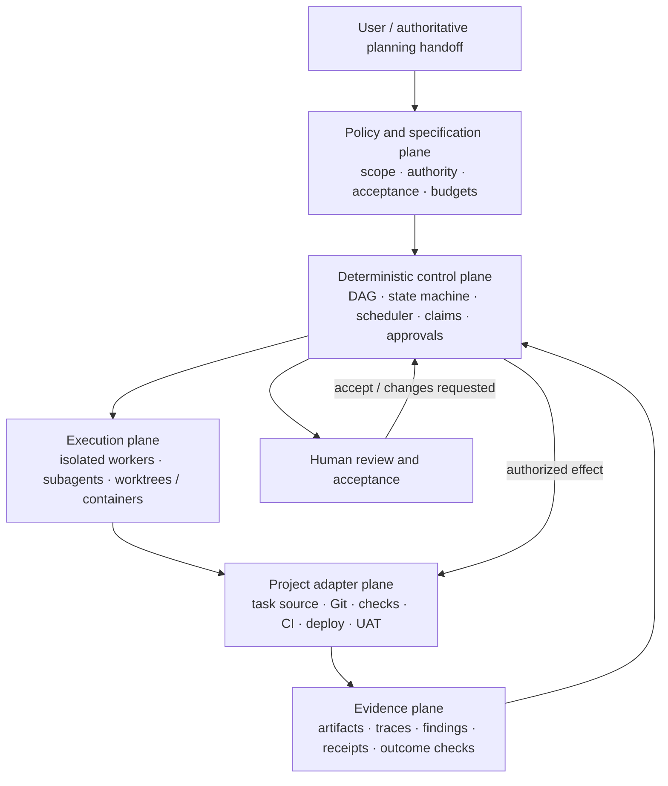

# Production-grade agentic delivery systems

Статус: exploratory research report, 2026-08-11. Документ описывает состояние
рынка, инженерные принципы и возможное направление ShipTask. Это не принятая
specification и не описание уже реализованного поведения `$ship-tasks`.

## Executive summary

Главный вывод исследования: большую agentic-систему следует проектировать не
как «команду умных собеседников», а как обычную надёжную распределённую систему,
внутри которой вероятностные workers решают ограниченные semantic-задачи.

Наиболее устойчивый рыночный consensus выглядит так:

1. Начинать с одного агента или детерминированного workflow. Multi-agent нужен
   только при измеримой границе capability, контекста, полномочий или
   независимого параллелизма.
2. State machine, budgets, permissions, retries, scheduling, approvals и
   external effects принадлежат детерминированному control plane, а не памяти
   модели.
3. Параллелизм полезен только при независимых task contracts, изолированных
   write surfaces и известной операции объединения результатов.
4. Durable state живёт вне model context. Workers должны быть заменяемыми, а
   run — восстанавливаться из идентификаторов, событий, артефактов и receipts.
5. Успех доказывает observed outcome, а не текст «готово». Deterministic checks,
   independent review, human acceptance и подтверждение внешнего effect —
   разные слои evidence.
6. Ограничивающий ресурс чаще всего не число agents, а человеческое внимание,
   integration capacity либо общий mutable resource. Поэтому оптимизировать
   нужно accepted throughput, first-pass yield и review load.
7. MCP, A2A и OpenTelemetry закрывают разные границы interoperability, но не
   задают lifecycle, authority, review queue или completion semantics
   инженерной delivery-системы.
8. Для ShipTask разумнее развивать собственный небольшой domain protocol
   вокруг Task Manager connector, а не принимать какой-либо agent framework за
   архитектуру продукта.

Рабочая гипотеза для проекта, которую ещё должен проверить Stage 0: в
ближайшем горизонте может быть выгоднее сочетать тонкий Task Manager-specific
skill,
нативные возможности Codex и Git/worktree isolation, а при подтверждённой
потребности — малый локальный runtime с inspectable event log. Temporal, Dapr,
Restate, DBOS или A2A следует оценивать только после появления конкретного
требования к многодневному, межмашинному или межорганизационному исполнению.

Отдельный
[community- и field-evidence срез](2026-08-11-agentic-development-in-practice.md)
проверяет эти выводы по выступлениям, independent engineering cases,
HN/Reddit, surveys и empirical studies. Он уточняет важную границу: массовым
baseline остаётся monitored single-agent, advanced worktree/multi-lane
workflows являются emerging practice, а большие autonomous swarms — пока
эксперимент, не отраслевой стандарт.

## 1. Scope, метод и уровень уверенности

Под «такими системами» здесь понимаются системы исполнения сложной инженерной
работы с участием LLM-agents:

- planning и decomposition;
- последовательное и параллельное исполнение;
- работа с кодом, инструментами и внешними системами;
- review, rework и human approval;
- integration, release и другие внешние effects;
- durability, recovery, security, observability и evaluation.

Исследование основано преимущественно на официальных specifications,
документации и инженерных публикациях OpenAI, Anthropic, Google, Microsoft,
GitHub, Linux Foundation, OpenTelemetry, NIST, ISO и OWASP. Это deliberate
primary-source landscape, а не community-practice survey. Отдельный
[companion report](2026-08-11-agentic-development-in-practice.md) закрывает
этот пробел по выступлениям, независимым кейсам, форумам и field studies. Оба
среза актуальны на 2026-08-11.

У evidence есть три разных уровня:

- **нормативное** — released protocol, product contract или формальный
  standard;
- **подтверждённая capability** — текущее документированное поведение продукта;
- **vendor evidence** — внутренний benchmark или заявление производителя,
  полезное как сигнал, но не как универсальная гарантия.

Числа из vendor benchmarks не переносятся на ShipTask без собственного
representative evaluation. Например, Anthropic сообщал примерно о 90% выигрыше
multi-agent research system над single-agent на своём внутреннем breadth-first
eval, но также о приблизительно пятнадцатикратном расходе токенов относительно
обычного chat. Авторы отдельно считают coding-задачи с общим контекстом менее
подходящими для этой топологии. Это важный контрпример тезису «больше агентов
всегда эффективнее», а не оценка нашего workflow.
[Источник: Anthropic](https://www.anthropic.com/engineering/multi-agent-research-system).

Ограничения исследования:

- сравнивались публичные capabilities и contracts, а не hands-on performance
  продуктов на одном benchmark;
- practitioner adoption и community consensus не выводились из vendor docs;
  для этого используется отдельный companion report с собственной рубрикой
  доказательности;
- быстро меняющиеся preview/GA статусы могут устареть после даты среза;
- vendor benchmarks не являются независимым сравнением;
- pricing и квоты сознательно не сравнивались: они нестабильны и не определяют
  архитектурные гарантии;
- предложенная roadmap является инженерной inference для текущей локальной
  границы ShipTask, а не результатом production load test.

Уверенность высокая в общих reliability/security принципах и released
protocol semantics, средняя — в долговечности текущих product surfaces, низкая
— в переносимости vendor performance claims.

## 2. Три независимые оси, которые рынок называет multi-agent

Термин `multi-agent` сейчас перегружен. Полезно разложить его на три
ортогональные возможности.

| Ось | Что она даёт | Чего она не гарантирует |
|---|---|---|
| Intra-task subagents | Делегирование research, проверки или узкой функции внутри одного run | Изоляцию Git writes, durable queue, межзадачную координацию |
| Inter-task workers | Параллельные sessions в отдельных branch, worktree, container или VM | Dependency DAG, merge policy, review backpressure |
| Delivery control plane | Очередь, state machine, scheduling, claims, approvals, integration и evidence | Качество semantic-решения каждого worker |

Например, нативные Codex subagents дают focused contexts и параллельное
read-heavy исследование, а worktrees дают независимые checkouts для отдельных
задач. Но это разные гарантии. Документация Codex прямо предупреждает, что
write-heavy subagents повышают риск конфликтов и coordination overhead;
worktree, в свою очередь, не является scheduler или security sandbox.
[Subagents](https://learn.chatgpt.com/docs/agent-configuration/subagents),
[worktrees](https://learn.chatgpt.com/docs/environments/git-worktrees).

Многие заметные coding-agent продукты частично реализуют первые две оси.
Полный третий слой — authority-aware delivery protocol с review capacity и
effect verification — всё равно остаётся ответственностью проекта.

## 3. Где проходит архитектурная граница

### 3.1. Deterministic control plane, probabilistic semantic plane

Самый важный принцип:

> Модель предлагает и интерпретирует; runtime владеет истиной, полномочиями,
> ограничениями и переходами состояния.

Обычный код должен контролировать:

- state machine и допустимые переходы;
- dependency graph, fan-out и fan-in;
- claims, leases, fencing и writer ownership;
- time, token, cost и attempt budgets;
- timeout, retry, cancellation и reconciliation;
- permissions, approval и policy enforcement;
- schema validation и deterministic gates;
- idempotency, external effects и receipts;
- audit trail и terminal conditions.

LLM полезен для:

- понимания неоднозначного запроса;
- semantic decomposition, когда состав работ заранее неизвестен;
- выбора релевантного контекста и инструментов;
- синтеза нескольких источников или вариантов;
- обнаружения содержательных рисков;
- review по сложной rubric.

Anthropic различает заранее заданные кодом workflows и agents, которые сами
динамически выбирают процесс; OpenAI рекомендует сначала одного агента и
добавлять специализацию только при реальной границе capability, policy или
context isolation.
[Anthropic](https://www.anthropic.com/engineering/building-effective-agents),
[OpenAI](https://developers.openai.com/api/docs/guides/agents/orchestration).

### 3.2. Почему minimal architecture — не консерватизм

Каждый дополнительный agent создаёт:

- новую context boundary;
- передачу ответственности и возможную потерю смысла;
- отдельную permission surface;
- дополнительные failure и termination modes;
- model и tool amplification;
- новую ветвь traces и evaluation;
- потенциальную очередь review и integration.

Поэтому правильная лестница усложнения обычно такова:

```text
один model call
→ один agent с tools
→ детерминированный workflow
→ coordinator с узкими workers
→ полноценная multi-agent topology
```

Второй agent оправдан, когда есть измеримая причина, а не только удобная
persona. OpenAI отдельно называет multi-agent плохим fit для строго
последовательной задачи, shared mutable state и одного медленного внешнего
operation.
[OpenAI multi-agent guide](https://developers.openai.com/api/docs/guides/responses-multi-agent).

## 4. Reference architecture

Для ShipTask полезна пятислойная архитектура. Runtime skill остаётся тонким
protocol/interface слоем; Task Manager connector, project execution и evidence
имеют явные границы.



### 4.1. Policy and specification plane

Содержит стабильные правила:

- exact scope и acceptance;
- разрешённые writes и external effects;
- risk classification;
- human acceptance authority;
- execution topology и budgets;
- версии policy, tool profiles и verification contracts.

Эта плоскость не хранит текущую очередь и не должна знать конкретный task
manager или deployment provider. Такая граница уже соответствует назначению
ShipTask.

### 4.2. Control plane

Владеет run-time truth:

- stable IDs;
- dependency-ready frontier;
- admission control;
- task claims и fencing;
- exact/adaptive concurrency;
- weighted review queue;
- state transitions и rework loops;
- approvals, idempotency keys и reconciliation.

Coordinator может использовать LLM для semantic planning, но не делегирует
модели enforcement этих правил.

### 4.3. Execution plane

Workers считаются disposable и ограниченными:

- один bounded task contract;
- минимально достаточный context;
- task-scoped tools и credentials;
- один active writer на mutable surface;
- отдельная branch/worktree/container, когда есть writes;
- структурированный result с evidence и uncertainty.

### 4.4. Adapter plane

Проектные детали подключаются как сменные capabilities:

- task source;
- repository и integration policy;
- deterministic checks;
- CI/release/deploy;
- UAT и post-effect verification;
- внешние communication или data systems.

Adapter не меняет общую семантику lifecycle. Он переводит её в названия и
operations конкретного проекта.

### 4.5. Evidence and human plane

Evidence является first-class state, а не приложением к финальному сообщению:

- exact base/result identities;
- artifacts и scope diff;
- deterministic check receipts;
- independent review findings;
- human decision, связанное с exact candidate;
- effect receipt и независимая проверка observed state;
- trace и provenance используемых versions.

Human interface должен показывать одно точное решение, а не заставлять
человека восстанавливать run по логам.

## 5. Основные orchestration patterns

| Паттерн | Когда полезен | Главный риск |
|---|---|---|
| Single agent with tools | Связная задача и один контекст | Контекст разрастается, producer сам себя проверяет |
| Prompt chaining | Известные последовательные стадии | Лишние model calls там, где достаточно кода |
| Router | Несколько устойчивых task classes | Ошибочная маршрутизация и скрытая policy |
| Agent-as-tool | Manager сохраняет владение общим outcome | Потеря существенной детали при возврате summary |
| Handoff | Специалист действительно получает следующий участок диалога и authority | Размытая ownership и сложный возврат |
| Fan-out / fan-in | Независимые источники, гипотезы, варианты или surfaces | Дублирование, дорогой merge, correlated errors |
| Orchestrator-worker | Неизвестный заранее состав независимых подзадач | Coordinator bottleneck и слабые task contracts |
| Evaluator-optimizer | Есть ясная rubric и полезен итеративный feedback | Бесконечный refinement и judge bias |
| Deterministic graph | Известный процесс, строгие gates и recovery | Избыточная схема для маленькой задачи |
| Peer debate / group chat | Независимые гипотезы и adversarial reasoning | Циклы, consensus on error, нет владельца финала |

Manager-worker является наиболее безопасным default для сложного run:
coordinator владеет целью, workers — bounded subtasks, verifier — критериями,
runtime — permissions и termination. Handoff нужен только при настоящей смене
владельца. OpenAI проводит то же различие между `agents as tools` и handoffs.
[Источник](https://developers.openai.com/api/docs/guides/agents/orchestration).

## 6. Task contract важнее persona

Имя вроде «Senior Reviewer» почти ничего не гарантирует. Полезная граница
worker задаётся contract:

- objective и non-goals;
- authoritative inputs и exact base;
- доступный context;
- owned read/write surface;
- tools, credentials и network policy;
- expected output schema;
- acceptance и evidence;
- time, token, cost и attempt budget;
- допустимые side effects;
- escalation и stopping rules.

Workers должны возвращать не только conclusion, но и:

- факты и их provenance;
- hypotheses отдельно от фактов;
- неизвестные и conflicts;
- artifacts или patch;
- выполненные checks;
- confidence только там, где он калиброван.

Большие результаты передаются artifact reference, а не многократно
пересказываются через цепочку agents. Это уменьшает semantic loss и стоимость
context.

## 7. Concurrency, scheduling и backpressure

### 7.1. Параллелизм допускается по доказательству

Для write-параллелизма одновременно нужны:

1. независимость в dependency graph;
2. изолированные mutable surfaces;
3. достаточная runtime capacity;
4. известная integration strategy;
5. свободная weighted review capacity;
6. authority на координацию и объединение результатов.

Отдельная branch/worktree предотвращает часть file-level конфликтов, но не
semantic conflicts, security compromise или перегрузку reviewer.

Надёжный инвариант:

> Один mutable object или integration surface — один активный writer.

Остальные workers могут возвращать proposals, patches или findings. Назначенный
owner выполняет fan-in.

### 7.2. Exact и adaptive topology

Следует различать:

- `exact` — `workers=N` является контрактом; невозможность поддерживать
  topology останавливает dispatch;
- `adaptive` — пользователь задаёт ceiling, а coordinator регулирует active
  target по фактическим ограничениям.

Для adaptive режима полезна модель:

```text
active_target = min(
  requested_ceiling,
  dependency_ready_tasks,
  isolated_execution_capacity,
  budget_capacity,
  available_weighted_review_buffer
)
```

Заполненная review queue является нормальным backpressure, а не поводом
запускать ещё workers ради utilization.

### 7.3. Review capacity нужно считать весом

Пять механических candidates и один архитектурный candidate создают разную
нагрузку. Поэтому buffer лучше выражать ожидаемыми review-minutes либо хотя бы
ordinal `review_load`, скорректированным на risk:

```text
available_review_buffer = review_capacity - queued_weighted_review_load
```

При выборе следующей ready task разумный порядок:

1. dependency и urgent/value constraints;
2. authority и isolation;
3. доступный review buffer;
4. task type и context affinity;
5. небольшой coherent batch;
6. отдельный маршрут для high-touch work.

Целевая функция — не максимальная занятость agents, а поток принятых
результатов при допустимых human cost, latency, compute cost и risk.

## 8. Durability и failure semantics

### 8.1. Durable state — не длинный chat

Model context не является журналом исполнения. Long-running run должен
восстанавливаться из внешнего state:

- append-only event log;
- materialized current state;
- stable run/task/candidate/effect IDs;
- versioned task contracts и policy;
- claims, leases и fencing tokens;
- artifacts, checks, approvals и receipts;
- reconciliation с observed external state.

Подход соответствует production workflow engines. Temporal, например,
рекомендует держать недетерминированные LLM/tool/API operations в Activities,
а workflow использовать для durable orchestration; Dapr Agents строит durable
agent loops поверх workflow и event-sourced state.
[Temporal](https://go.temporal.io/platform-hub/ai-engineering/ai-reference-architecture),
[Dapr](https://docs.dapr.io/developing-ai/dapr-agents/dapr-agents-core-concepts/).

### 8.2. Failure classes нельзя сводить к retry

| Failure | Правильная реакция |
|---|---|
| Transient transport/provider error | Bounded retry с backoff, jitter и budget |
| Rate limit или capacity | Backpressure, reschedule, возможно другой разрешённый provider |
| Deterministic validation failure | `changes-requested` / rework, не слепой retry |
| Semantic wrong result | Новый candidate с зафиксированной причиной rework |
| Stale worker или lost heartbeat | Lease expiry, fencing и reconciliation |
| Policy/authority conflict | Stop и human decision |
| Context/base drift | Invalidate candidate, refresh и replan |
| Unknown external-effect outcome | Проверить status/receipt; не повторять вслепую |
| Harness/grader defect | Исправить verification layer, не наказывать worker |

Каждый цикл ограничивается числом попыток, временем, token/cost budget и
условием эскалации. «Попробовать ещё раз» не является recovery policy.

### 8.3. External effects и миф exactly-once

Распределённый runtime сам по себе не делает внешний effect exactly-once.
Практический контракт:

1. создать stable `effect_id` и idempotency key;
2. записать intent до вызова либо использовать transactional outbox;
3. выполнить effect с минимальными credentials;
4. сохранить provider receipt;
5. независимо проверить observed state;
6. reconciliation решает uncertain outcomes;
7. retry разрешён только при доказанной idempotency.

Для систем без idempotency API нужен отдельный lookup/deduplication strategy
или human gate. Отсутствие ответа нельзя интерпретировать ни как успех, ни как
безопасное разрешение повторить действие.

### 8.4. Pause не равен quiescence

Флаг `paused`, остановка coordinator или протухший lease не доказывают, что
running worker уже не выполняет команду. Безопасная остановка требует
двухфазного протокола:

```text
pause-requested
→ stop new dispatch
→ drain или безопасно cancel running lanes
→ каждый in-flight effect становится verified либо ambiguous
→ fence/release claims
→ quiescent
```

Только `quiescent` разрешает takeover или перенос run. Temporal, например,
прямо указывает, что pause не останавливает уже исполняющиеся Activity
attempts; это хорошая иллюстрация общей границы durable runtimes.
[Источник](https://docs.temporal.io/encyclopedia/workflow/workflow-pause).

## 9. State and evidence model

Ниже — exploratory data model, а не уже принятое расширение workflow.

| Entity | Минимальные поля |
|---|---|
| `Run` | `run_id`, scope digest, base identity, policy version, topology, budgets |
| `Task` | `task_id`, type, dependencies, acceptance, risk, owned surface |
| `Claim` | owner, lease expiry, fencing token, heartbeat |
| `Candidate` | candidate ID, exact base/result, scope diff, checks, review load |
| `Review` | reviewer/evaluator, candidate ID, findings, rubric version, decision |
| `Approval` | actor, exact action/candidate, policy version, expiry, decision |
| `Effect` | effect ID, target, idempotency key, receipt, observed verification |
| `Event` | sequence, actor, entity, transition, trace ID, timestamp |

Полезно различать domain state и execution substate. Нормативный lifecycle ShipTask
может остаться компактным, а runtime отдельно знать `claimed`, `lease-lost`,
`integrating` и `reconciling`. Иначе инфраструктурные детали начнут протекать
в runtime skill.

Approval должен быть связан с exact candidate или exact proposed action,
policy version и сроком действия. Общая фраза «можно продолжать» не должна
становиться повторно используемым permission token.

## 10. Context, memory и knowledge

### 10.1. Четыре разных вида памяти

| Вид | Пример | Правило |
|---|---|---|
| Authoritative source | spec, issue, repository, policy | Source of truth, versioned и проверяемый |
| Working context | transcript, scratchpad, retrieved chunks | Ephemeral, bounded, не authority |
| Durable run state | events, claims, candidates, approvals | Structured, resumable, auditable |
| Learned heuristic | task profile, common rework cause | Opt-in, reviewed, не меняет policy молча |

Смешивание этих классов порождает опасную «память агента», где старое summary
выглядит как текущий факт.

### 10.2. Context engineering

Практические правила:

- worker получает минимально достаточный task packet;
- retrieval идёт от canonical sources, а не от старого chat summary;
- context связан с base SHA, source revision, policy и tool versions;
- drift инвалидирует зависимые candidates;
- facts, hypotheses, decisions и open questions разделены структурно;
- completed phase компактизируется в state + artifact references;
- secrets и raw private content не попадают в trace по умолчанию;
- learned rules изменяются только через отдельный reviewable процесс.

Anthropic для long-running coding agents рекомендует initializer, feature list,
progress artifacts и Git history, чтобы новый context мог продолжить работу по
наблюдаемому state, а не пытаться восстановить всё из предыдущего transcript.
[Источник](https://www.anthropic.com/engineering/effective-harnesses-for-long-running-agents).

## 11. Verification, evals и observability

### 11.1. Outcome важнее trajectory

Нужно оценивать отдельно:

- **outcome** — достигнуто ли реальное конечное состояние;
- **trajectory** — разумно ли выбраны tools, handoffs и steps;
- **policy** — соблюдены ли authority и mandatory gates;
- **efficiency** — какой ценой достигнут результат.

Exact trajectory требуется только там, где путь нормативен: approval,
запрещённый tool, обязательная проверка или irreversible action. Во всех
остальных случаях система не должна наказывать валидное альтернативное
решение. Такой подход рекомендуют Anthropic и OpenAI.
[Anthropic evals](https://www.anthropic.com/engineering/demystifying-evals-for-ai-agents),
[OpenAI trace grading](https://developers.openai.com/api/docs/guides/trace-grading).

### 11.2. Три класса graders

- deterministic/code graders — hard facts, schemas, tests и policy invariants;
- model graders — semantic rubric, relevance и qualitative review;
- human graders — acceptance, ambiguous quality и calibration.

LLM judge нельзя принимать за ground truth. Его нужно регулярно сверять с
людьми, измерять false-pass/false-fail и предпочтительно задавать pass/fail или
pairwise rubric вместо расплывчатого score.
[OpenAI evaluation practices](https://developers.openai.com/api/docs/guides/evaluation-best-practices).

Capability suite и regression suite также различаются: первая содержит
сложные задачи с пространством для улучшения, вторая — уже освоенные invariants
с почти обязательным успехом. Один удачный run не доказывает reliability;
для недетерминированных critical classes нужны повторные trials и `pass^k`, а
для поиска нескольких кандидатов может быть уместен `pass@k`.

### 11.3. Production feedback loop

```text
production traces
→ incident and failure analysis
→ curated eval cases
→ deterministic + model graders
→ periodic human calibration
→ regression gate
→ sampled online evaluation
→ new failures back to dataset
```

Trace объясняет outcome, но не заменяет его. Production failure должен
превращаться в минимальный reproducible regression case, а не только в новую
строку prompt.

### 11.4. Метрики

Метрики следует сегментировать по `task_type`, `risk_class`, execution surface,
workflow/model/tool version и evaluator version.

**Outcome и quality:**

- accepted terminal success rate;
- first-pass acceptance rate;
- `pass^k` для critical classes;
- escaped failure/rollback rate;
- policy violation rate;
- completeness и grounding/provenance.

**Human load:**

- review minutes per accepted task;
- review touches и changes-requested rate;
- time to first/final review;
- weighted review backlog;
- escalation и interrupt count;
- human/judge agreement.

**Rework:**

- tasks хотя бы с одним rework;
- cycles, human minutes, agent time, tokens и cost после первого candidate;
- structured rework reason;
- recurrence одной failure category;
- время от production failure до regression case.

**Latency и cost:**

- end-to-end time до accepted outcome;
- queue, execution, review и integration time отдельно;
- p50/p95/p99;
- model/tool calls, turns, retries и tokens;
- cost per accepted outcome и per first-pass accepted outcome.

**Tool reliability:**

- transport/auth/rate-limit failures;
- schema errors;
- wrong, missing и unnecessary tool calls;
- semantically wrong arguments;
- unverified side effects;
- p95 latency и retry rate.

Не следует использовать `agents active`, raw token count или созданные PR как
главную success metric. Они измеряют activity, а не value и correctness.

### 11.5. OpenTelemetry

OpenTelemetry GenAI уже предлагает vendor-neutral vocabulary для inference,
agent, workflow, planning, tool и evaluation spans/events, включая duration,
token usage, inference calls и tool calls. Но на текущую дату отдельные GenAI
semantic conventions имеют статус `Development`, не released stable contract.
Поэтому ShipTask должен иметь собственную versioned domain schema и только
экспортировать её в OTel через adapter.
[OpenTelemetry GenAI](https://github.com/open-telemetry/semantic-conventions-genai),
[document status](https://opentelemetry.io/docs/specs/otel/document-status/).

Raw prompts, system instructions, tool arguments/results и memories должны
логироваться только opt-in: они могут содержать PII, secrets и большие
payloads. В trace безопаснее хранить metadata, digest и access-controlled
artifact reference.

## 12. Security and governance

### 12.1. Threat model

| Угроза | Типичный путь | Основная защита |
|---|---|---|
| Direct/indirect prompt injection | Issue, repository, web page, tool result | Untrusted content как data; policy вне модели; output validation |
| Excessive agency | Слишком широкие tools/credentials | Least privilege, scoped tokens, action-specific approval |
| Data exfiltration | Network, MCP server, logs, dependency script | Egress allowlist, sandbox, secret isolation, content redaction |
| Tool poisoning / confused deputy | Malicious description или server | Allowlist, pinned identity/version, gateway policy, schema checks |
| Memory poisoning | Старый или вредоносный summary становится authority | Provenance, source revision, namespace и review |
| Supply-chain compromise | Skill, package, model, MCP server | Pinning, signatures/attestations, inventory и provenance |
| Cross-agent impersonation | Поддельный message/card/task | Mutual authentication, audience binding, message integrity |
| Zombie/stale writer | Потерянный worker продолжает writes | Lease + fencing token + CAS |
| Approval laundering | Старое consent используется для нового candidate | Candidate/action-bound, expiring approval |
| Unverified external effect | Agent сообщает успех без observed state | Receipt, independent lookup и reconciliation |

NIST в 2026 году отдельно выделяет prompt injection, poisoned components,
specification gaming, identity и interoperability gaps как ключевые темы
agent security; OWASP Top 10 for Agentic Applications даёт полезную threat
taxonomy, но не является сертификационным стандартом.
[NIST initiative](https://www.nist.gov/news-events/news/2026/02/announcing-ai-agent-standards-initiative-interoperable-and-secure),
[OWASP guidance](https://genai.owasp.org/resource/owasp-top-10-for-agentic-applications-for-2026/).

### 12.2. Control hierarchy

Надёжность controls убывает примерно в таком порядке:

1. отдельный disposable container/VM и OS sandbox;
2. task-scoped identity, credentials и network policy;
3. server-side authorization и policy engine;
4. deterministic validation, approval gate и effect broker;
5. runtime budgets, leases, fencing и audit log;
6. tool allowlists и signed/pinned capability manifests;
7. prompt instructions.

Prompt важен для поведения, но не является security boundary.

Полезная приблизительная модель blast radius:

```text
risk ∝ privileges × accessible data × untrusted input
       × egress × irreversibility × autonomy duration
```

Она не является количественной risk formula, но хорошо задаёт порядок
проектирования: сначала уменьшить возможные последствия компрометации, затем
улучшать model-based detection.

Approval UI должен показывать exact action, target, outgoing data, обратимость,
evidence и последствия отказа. Sandbox capability и approval policy являются
разными осями: первое ограничивает технически возможное, второе — разрешённое
в рамках текущей authority. Это же различие проводит документация Codex.
[Источник](https://learn.chatgpt.com/docs/agent-approvals-security).

## 13. Standards и protocols

### 13.1. Стандартизованные границы и mature guidance

| Класс | Артефакт | Что он задаёт | Текущая граница |
|---|---|---|---|
| Interoperability protocol | MCP 2026-07-28 | Agent/host ↔ tools, resources, prompts; capability negotiation | Не является app state или delivery scheduler |
| Interoperability protocol | A2A 1.0 | Independent agent ↔ agent: cards, tasks, messages, artifacts, streaming | Не задаёт внутреннюю topology, trust policy или acceptance |
| Typed contract specification | [JSON Schema 2020-12](https://json-schema.org/draft/2020-12) / [OpenAPI 3.2](https://spec.openapis.org/oas/v3.2.0.html) | Typed payload и HTTP/tool contracts | Не гарантирует semantic correctness |
| Identity building blocks | [OAuth security BCP](https://www.rfc-editor.org/rfc/rfc9700.html) / OIDC / mTLS | Identity и delegated access | Scope и authorization policy определяет система; [OAuth 2.1](https://datatracker.ietf.org/doc/draft-ietf-oauth-v2-1/) всё ещё draft |
| Observability standard | OpenTelemetry core | Vendor-neutral traces, metrics и logs | Agent/GenAI conventions пока Development |
| Governance standard | ISO/IEC 42001:2023 | AI management system и governance | Не техническая orchestration specification |
| Risk guidance | ISO/IEC 23894:2023 | AI risk-management process | Не lifecycle или protocol |
| Risk framework | NIST AI RMF / GenAI Profile | Voluntary risk-management framework | Не conformance standard agent runtime |
| Threat guidance | OWASP Agentic Top 10 | Threat taxonomy и mitigations | Не certification |

MCP перешёл к stateless core с durable handles/tasks через extensions и явно
не должен использовать connection как app state. A2A 1.0, напротив,
стандартизует stateful long-running `Task`, artifacts, polling, streaming и
webhooks между независимыми агентами.
[MCP release](https://blog.modelcontextprotocol.io/posts/2026-07-28/),
[A2A specification](https://a2a-protocol.org/latest/specification/).

Практическое правило:

- MCP — для подключения tool/context capability;
- A2A — для independently deployed agent/task boundary;
- typed function или queue message — для внутренних workers одного runtime;
- ни MCP, ни A2A не являются доказательством доверия или корректности.

### 13.2. Что пока не стандартизовано

Нет общепринятого стандарта на:

- delivery lifecycle и terminal outcome;
- delegation authority и writer ownership;
- task/review queue schema;
- review capacity и human acceptance;
- candidate identity и rework semantics;
- memory authority и invalidation;
- exact external-effect evidence;
- eval dataset, quality или efficiency metrics;
- merge/integration protocol нескольких coding workers.

NIST только запустил AI Agent Standards Initiative в 2026 году, что само по
себе подтверждает незрелость этой области. Следовательно, ShipTask не следует
ждать универсальный стандарт: разумнее version-ить собственную domain schema и
поддерживать mappings к emerging protocols.

## 14. Market landscape

### 14.1. Coding-agent products

| Продукт | Подтверждённая сильная сторона | Существенная граница |
|---|---|---|
| OpenAI Codex | Subagents, focused contexts, worktrees/cloud tasks, sandbox и approvals | Эти surfaces не образуют автоматически общий DAG/merge/review coordinator |
| Claude Code | Programmable subagents, per-agent context/tools, worktrees и dynamic fan-out/fan-in | [Agent teams](https://code.claude.com/docs/en/agent-teams) experimental, а [Agent view](https://code.claude.com/docs/en/agent-view) research preview |
| GitHub Copilot cloud agent | Async single-repo branch/PR worker, ephemeral environment, logs и human merge gate | Одна session — одна branch/PR; нет документированного общего delivery DAG |
| Google Jules | Параллельные isolated VM sessions, patch/branch/PR output, internal critics | Parallel fan-out не равен совместной team orchestration |
| Cursor | Local/cloud/SSH agents, per-agent worktrees, alternative attempts и approval routing | Cloud/API capabilities имеют иные approval/network boundaries; best-of-N не делает fan-in |
| Devin | Managed parallel sessions, [command center](https://docs.devin.ai/desktop/agent-command-center), budgets и automations | Human gate зависит от configuration; [Outposts](https://docs.devin.ai/cloud/outposts/overview) переносит tool execution, но не inference plane |
| Factory Missions | Orchestrator, workers, validators, milestones, control UI и persistent mission state | Vendor прямо отмечает human intervention и открытый вопрос broad parallelism |
| Anthropic research system | Сильный breadth-first orchestrator-worker research pattern | Внутренний research eval; дорого по tokens и хуже fit для shared-context coding |

GitHub и Jules сходятся на зрелом практическом envelope:

```text
task/session
→ isolated environment
→ branch/patch/PR
→ checks and logs
→ human review
```

Это полезный execution lane, но ещё не управление большой программой работ.
GitHub cloud agent документирует one-repository/one-branch/one-PR session и
human-controlled merge; Jules даёт отдельную VM на task и несколько
параллельных sessions.
[GitHub](https://docs.github.com/en/copilot/concepts/agents/cloud-agent/about-cloud-agent),
[Jules](https://jules.google/docs/tasks-repos/).

Claude Code и Cursor показывают более программируемый local/fleet surface, а
Devin — более выраженный coordinator и очередь состояний, требующих внимания.
Это сравнительная интерпретация публичных capabilities, а не общий benchmark.
И здесь maturity нужно хранить по отдельной capability, а не по бренду: team
view, cloud API, review и sandbox могут одновременно находиться в разных
статусах.
[Claude subagents](https://code.claude.com/docs/en/sub-agents),
[Cursor agents](https://cursor.com/docs/agent/agents-window),
[Devin command center](https://docs.devin.ai/desktop/agent-command-center).

Среди изученных products Factory Missions по нашей сравнительной интерпретации
ближе других к delivery control plane: correctness contract, features,
milestones, implementers и отдельные validators. Это не утверждение о полной
production зрелости: Factory сама пишет, что Missions продолжают развиваться,
не являются fire-and-forget, а ценность broad parallelism остаётся открытым
вопросом.
[Factory Missions](https://docs.factory.ai/missions/overview),
[architecture](https://factory.ai/news/missions-architecture).

### 14.2. Agent frameworks

| Framework | Модель | Durability / HITL | Практическая оценка |
|---|---|---|---|
| LangGraph | Stateful graph, nodes/edges, BSP parallel steps | Checkpointers, interrupts, replay/fork | Много контроля; schema, idempotency и ops остаются у разработчика |
| Google ADK | LLM agents плюс Sequential/Parallel/Loop workflows | Sessions/state; deployment зависит от platform | Хорош для гибридной deterministic/dynamic topology |
| Microsoft Agent Framework | Agents, workflows, handoffs/checkpoints | Checkpoints и human handoff primitives | Широкий enterprise stack, выше framework coupling |
| PydanticAI | Typed Python agents, tools и structured outputs | Через Temporal/DBOS/Prefect/Restate; deferred tools | Сильная типизация; durability не встроена в core |
| CrewAI | Role/task Crews и event-driven Flows | Checkpoints и human feedback; часть ops в AMP | Быстрый authoring, но выше риск моделировать personas вместо contracts |
| OpenAI Agents SDK | Agents-as-tools, handoffs, guardrails, traces | Application/runtime responsibility | Малый agent layer, не delivery scheduler |

LangGraph resume происходит от checkpoint boundary, поэтому side effects
должны быть idempotent; PydanticAI прямо выносит production durability в
отдельные workflow engines. Это хороший рыночный signal: agent framework и
durable execution — разные слои.
[LangGraph persistence](https://docs.langchain.com/oss/python/langgraph/persistence),
[PydanticAI durability](https://pydantic.dev/docs/ai/capabilities/durable_execution/overview/).

Framework следует выбирать по нужной topology и operational model, а не по
числу готовых agent personas. Для ShipTask ни один из них не заменяет domain
protocol, authority и evidence semantics.

### 14.3. Durable workflow engines

| Engine | Сильная сторона | Цена/граница |
|---|---|---|
| Temporal | Durable replay, Activities, timers, signals/updates, mature ops | Требует deterministic workflow discipline и отдельной infrastructure |
| Dapr Workflows/Agents | Building blocks, actors/state/pub-sub, workflow-backed agents | Значительный platform footprint |
| Restate | Durable functions/objects, promises и HITL pause/resume | Новый operational/runtime choice |
| DBOS | Postgres-backed durable workflows, Python/TypeScript proximity | Лучше для application-embedded use case, чем для универсального protocol |

Все они помогают пережить process failure, но не определяют acceptance,
authority или смысл completion. Для локального single-user ShipTask начинать с
такого engine преждевременно; нужен observable requirement: многодневные runs,
несколько machines, HA, большой event volume или сложные timers/signals.

## 15. Что уже сильного в ShipTask

Текущая [specification](../specs/ship-tasks.md) хорошо совпадает с найденным
consensus:

- exact planning handoff отделён от execution;
- adaptive execution ограничивается безопасным target, а serial применяется
  для одной ready task и связного write-critical path;
- parallel writes требуют независимых surfaces и coordination authority;
- `active_target` учитывает dependency frontier и review buffer;
- deterministic checks, agent review и human acceptance разделены;
- review queue содержит coherent candidates, а не worker reports;
- human acceptance связано с exact base/result;
- lifecycle явно содержит rework;
- completion отделяет source identity, checks, acceptance и external effects;
- skill честно не обещает persistent queue без отдельного runtime;
- project-specific refs, commands и policy не зашиваются в runtime core.

Это более зрелая основа, чем простая способность породить несколько agents.

## 16. Gaps и идеи для дальнейшего проектирования

Следующие элементы пока стоит считать research backlog, не принятой частью
workflow contract:

1. **Versioned domain schema.** Формальные `Run`, `Task`, `Claim`, `Candidate`,
   `Review`, `Approval`, `Effect` и `Event`.
2. **Runtime transition semantics.** CAS, leases, fencing, cancellation,
   takeover и reconciliation.
3. **Failure taxonomy.** Отделить transient retry, semantic rework, policy
   conflict, stale context и unknown effect.
4. **Task profile.** `task_type`, `review_load`, `context_affinity`, expected
   autonomy и high-touch routing.
5. **Weighted review admission.** Capacity по времени/риску, а не только count.
6. **Budget contract.** Time, attempts, tokens, money, tool calls и escalation.
7. **Context provenance.** Base/source/policy/tool versions и invalidation.
8. **Capability manifest.** Adapter identity, permissions, network, sandbox,
   idempotency и verification capabilities.
9. **Effect broker.** Idempotency keys, receipts, independent verification и
   reconciliation.
10. **Eval protocol.** Representative datasets, regression/capability suites,
    repeated trials и human calibration.
11. **Integration owner.** Один явный fan-in writer и conflict policy.
12. **Observability adapter.** Собственная stable schema с экспортом в OTel,
    без raw private content по умолчанию.
13. **Execution risk envelope.** `data_class`, `reversibility`, `egress`,
    `autonomy_tier` и immutable action/tool manifest.

Предыдущий [разбор доклада о workload](2026-08-11-multi-agent-workload-ideas.md)
уже подробно рассматривает `task_type`, weighted review load,
`rework_reason`, high-touch work и adaptive dispatch.

## 17. Рекомендуемая roadmap для ShipTask

### Stage 0 — baseline и representative runs

- не менять runtime contract;
- вручную собирать task type, review load и rework reason;
- зафиксировать single-agent/serial baseline;
- выбрать несколько routine, risky, decision-required и effectful scenarios;
- измерять accepted outcome, human minutes, lead time и cost.

Exit criterion: понятно, какие реальные bottlenecks есть у ShipTask, а не у
абстрактной multi-agent системы.

### Stage 1 — domain protocol specification

- определить IDs, entities, events, state invariants и authority;
- описать failure/retry/rework semantics;
- формализовать candidate-bound approval и effect receipt;
- сохранить runtime execution substates вне компактного runtime skill;
- определить migration policy для durable state.

Exit criterion: Task Manager mapping сохраняет lifecycle без скрытых project
assumptions.

### Stage 2 — минимальный local reference runtime

Если Stage 0–1 докажут необходимость runtime, рекомендуемый первый
implementation — один coordinator process, SQLite WAL или эквивалентный
inspectable local store, append-only events и materialized state. Это
архитектурная гипотеза для текущей single-user/local границы, которую ещё нужно
проверить прототипом.
CLI/API должны поддерживать:

- create/resume/status;
- claim/heartbeat/release;
- CAS transitions;
- candidate/review/approval;
- cancel/reconcile;
- dry-run и export evidence.

Почему не сразу Temporal: текущему single-user локальному workflow важнее
простота инспекции, миграций и удаления, чем HA и distributed scale.

Exit criterion: process можно убить в ключевых точках и восстановить run без
duplicate effect или потери authority.

### Stage 3 — review and evidence control plane

- bounded review packets;
- weighted queue и admission control;
- delta packets после rework;
- candidate-bound human decisions;
- structured rework reasons;
- provenance и effect verification.

Exit criterion: reviewer видит один decision surface, а метрики различают
execution, queue, review и rework.

### Stage 4 — connector and project interfaces

- Task Manager connector;
- Git/integration;
- deterministic checks;
- external effects;
- UAT/observed-state verification;
- capability and security manifest.

MCP уместен для сменных tool/context capabilities. Adapter contract не должен
зависеть от MCP там, где достаточно typed local interface.

Exit criterion: project-specific refs и policy не просачиваются в runtime
skill.

### Stage 5 — bounded multi-agent scheduler

- сначала read-heavy context harvest;
- затем независимые write lanes с one-writer ownership;
- exact/adaptive topology;
- task contracts, budgets и artifact fan-in;
- independent verifier, который не исправляет результат сам;
- доказательство выигрыша против serial baseline.

Exit criterion: accepted throughput или lead time улучшаются без ухудшения
first-pass yield, human review cost, defects и total cost.

### Stage 6 — distributed durability и interoperability

Temporal/Dapr/Restate/DBOS стоит оценивать, когда появились многодневные runs,
несколько processes/machines, сложные timers/signals или operational HA. A2A
нужен только для independently deployed agents разных owners/vendors.

Exit criterion: выбранная infrastructure решает измеренное требование и не
становится новым source of truth для domain semantics.

## 18. Anti-patterns

- Начинать с «команды ролей», не имея single-agent baseline.
- Считать subagent, worktree и durable worker одной capability.
- Давать нескольким agents write access к одному mutable surface.
- Хранить authoritative state в prompt или transcript.
- Просить модель соблюдать budgets, permissions или retry limit без runtime
  enforcement.
- Считать agent self-review независимой приёмкой.
- Автоматически merge/release по LLM score.
- Повторять неизвестный внешний effect без idempotency и reconciliation.
- Передавать bearer token через цепочку agents или MCP/A2A messages.
- Считать Agent Card, MCP manifest или tool description доказательством trust.
- Логировать prompts, tool payloads, secrets и private content по умолчанию.
- Использовать один общий `agent quality score`.
- Оптимизировать agents active, PR count или raw token efficiency вместо
  accepted outcome.
- Параллелить dependency chain или общий rate-limited resource.
- Добавлять framework до появления topology/runtime requirement.
- Обучать rules на session logs без opt-in, provenance и human review.
- Выдавать proposal, preview API или vendor benchmark за реализованный
  production contract.

## 19. Решение для текущего горизонта

Наиболее рациональная целевая формулировка:

> ShipTask — evidence-governed delivery protocol и, возможно, небольшой
> reference control plane. Он управляет authority, candidates, review,
> acceptance и effects, а agents, task managers, Git, CI и deployment systems
> подключаются как сменные execution/adapters.

Другими словами, control plane компилирует декларативный task contract в
ограниченный execution envelope, а затем принимает результат только по
проверяемому evidence bundle.

Это направление даёт проекту собственную ценность. Ещё один abstraction layer
над spawn/handoff будет конкурировать с быстро меняющимися SDK. Стабильная
семантика принятого результата, полномочий и доказанного external effect,
напротив, сейчас почти нигде не стандартизована.

Следующий полезный шаг — не менять `SKILL.md`, а проверить Stage 0 на реальных
runs и затем отдельно спроектировать domain protocol Stage 1. Только после
этого можно осмысленно решить, нужен ли локальный runtime и какой именно.

## 20. Ключевые источники

### Архитектура и evals

- [Anthropic: Building effective agents](https://www.anthropic.com/engineering/building-effective-agents)
- [Anthropic: Multi-agent research system](https://www.anthropic.com/engineering/multi-agent-research-system)
- [Anthropic: Evals for AI agents](https://www.anthropic.com/engineering/demystifying-evals-for-ai-agents)
- [OpenAI: Agent orchestration](https://developers.openai.com/api/docs/guides/agents/orchestration)
- [OpenAI: Multi-agent systems](https://developers.openai.com/api/docs/guides/responses-multi-agent)
- [OpenAI: Agent evals](https://developers.openai.com/api/docs/guides/agent-evals)
- [Microsoft: Magentic-One](https://www.microsoft.com/en-us/research/articles/magentic-one-a-generalist-multi-agent-system-for-solving-complex-tasks/)

### Protocols, security и governance

- [MCP 2026-07-28 release](https://blog.modelcontextprotocol.io/posts/2026-07-28/)
- [A2A 1.0 specification](https://a2a-protocol.org/latest/specification/)
- [OpenTelemetry GenAI conventions](https://github.com/open-telemetry/semantic-conventions-genai)
- [NIST AI Agent Standards Initiative](https://www.nist.gov/artificial-intelligence/ai-agent-standards-initiative)
- [NIST Generative AI Profile](https://www.nist.gov/publications/artificial-intelligence-risk-management-framework-generative-artificial-intelligence)
- [ISO/IEC 42001:2023](https://www.iso.org/standard/42001)
- [ISO/IEC 23894:2023](https://www.iso.org/standard/77304.html)
- [OWASP Top 10 for Agentic Applications 2026](https://genai.owasp.org/resource/owasp-top-10-for-agentic-applications-for-2026/)

### Frameworks и durability

- [LangGraph](https://docs.langchain.com/oss/python/langgraph/overview)
- [Google ADK workflows](https://adk.dev/workflows/)
- [Microsoft Agent Framework](https://learn.microsoft.com/en-us/agent-framework/)
- [PydanticAI durable execution](https://pydantic.dev/docs/ai/capabilities/durable_execution/overview/)
- [Temporal AI reference architecture](https://go.temporal.io/platform-hub/ai-engineering/ai-reference-architecture)
- [Dapr Agents patterns](https://docs.dapr.io/developing-ai/dapr-agents/dapr-agents-patterns/)
- [Restate human-in-the-loop](https://docs.restate.dev/ai/patterns/human-in-the-loop)
- [DBOS AI quickstart](https://docs.dbos.dev/ai/ai-quickstart)

### Coding-agent products

- [Codex subagents](https://learn.chatgpt.com/docs/agent-configuration/subagents)
- [GitHub Copilot cloud agent](https://docs.github.com/en/copilot/concepts/agents/cloud-agent/about-cloud-agent)
- [Google Jules](https://jules.google/docs/)
- [Claude Code subagents](https://code.claude.com/docs/en/sub-agents)
- [Cursor agents](https://cursor.com/docs/agent/agents-window)
- [Devin advanced capabilities](https://docs.devin.ai/work-with-devin/advanced-capabilities)
- [Factory Missions](https://docs.factory.ai/missions/overview)
