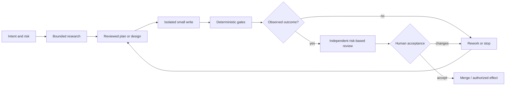

# Как на практике разрабатывают с coding agents

Статус: exploratory research report, 2026-08-11. Это community- и
field-evidence дополнение к
[архитектурному landscape](2026-08-11-agentic-delivery-systems-landscape.md),
а не принятая specification и не описание уже реализованного поведения
`$ship-tasks`.

## Короткий ответ

В предыдущем landscape основой были specifications, официальная документация
и engineering-публикации производителей. Этого достаточно для архитектурных
границ и protocol semantics, но недостаточно, чтобы ответить, как разработчики
реально работают сейчас. Для этого отчёта дополнительно исследованы:

- восемь выступлений 2025–2026 годов: записи сверялись с transcript или
  подробными time-coded notes; не все видео просматривались непрерывно от
  начала до конца;
- двенадцать engineering-кейсов, practitioner workflow descriptions и
  failure retrospectives разных авторов;
- двенадцать тематических Hacker News discussions и одиннадцать Reddit threads,
  а также несколько GitHub/Cursor forum discussions;
- опросы DORA и Stack Overflow, randomized и behavioral studies METR,
  Microsoft и Anthropic, а также несколько observational studies.

Вывод отличается и от рекламного «роя автономных программистов», и от тезиса
«ничего не изменилось».

Наиболее распространённый режим — один контролируемый agent, ограниченная
задача, явный human owner и обычные engineering gates. Продвинутые практики
добавляют отдельные research/review contexts, versioned plan, worktree или
remote sandbox и иногда две-три независимые execution lanes. Большие swarms,
полностью unattended delivery и «человек больше не читает код» остаются
экспериментами, а не рыночной нормой.

Устойчивый practitioner pattern можно кратко записать так:

```text
intent
→ bounded research
→ reviewed plan or design alignment
→ isolated implementation
→ deterministic feedback
→ independent/risk-based review
→ human acceptance
→ merge or authorized effect
```

Это не новый формальный стандарт. Это emerging consensus вокруг усиленной
классической инженерии: меньше scope, быстрее feedback, больше проверяемых
инвариантов и явнее человеческая ответственность.

## 1. Метод и границы доказательности

### 1.1. Выборка

Корпус собран целенаправленно, а не случайно. В него включались источники,
которые хотя бы частично раскрывают:

- реальный workflow или production architecture;
- task type и контекст применения;
- checks, review, permissions и failure modes;
- метрики, transcripts, commits либо конкретные postmortems;
- ограничения и контрпримеры, а не только заявленный успех.

Исключались поверхностные списки prompt tricks, SEO-пересказы, демонстрации без
проверяемого результата и очевидная самореклама без инженерных деталей.

Выборка смещена к англоязычным early adopters, sophisticated tools и
публичным авторам. HN, Reddit и выступления показывают диапазон практик, но не
доли рынка. Upvotes отражают резонанс, а не корректность; claims об ускорении
обычно невозможно проверить. Поэтому community evidence не используется как
статистика adoption или productivity.

### 1.2. Evidence ladder

| Уровень | Что считается evidence | Как используется |
|---|---|---|
| A | Randomized или хорошо описанное field study, открытый метод, реальные outcomes | Для причинных или сильных directional выводов с оговорками |
| B | Production case с operational details и метриками, либо крупный behavioral dataset | Для подтверждения возможности и наблюдаемого паттерна, не универсального эффекта |
| C | Подробный practitioner case, transcript, commits или failure retrospective | Для выявления повторяемых practices и failure modes |
| D | Forum self-report, talk prescription или vendor manifesto | Для гипотез и контрпримеров, не для market claim |

Паттерн в этом отчёте называется **consensus**, только если он повторяется
минимум в трёх разных классах источников и имеет независимое от vendor
подтверждение. Повторяемая, но пока в основном anecdotal практика называется
**emerging**. Если опыт явно расходится по контексту, вывод помечается как
**contested**. Roadmap, прогнозы и впечатляющие единичные demos считаются
**speculative**.

### 1.3. Что измеряется

Следует различать как минимум четыре результата:

1. wall-clock time до принятого результата;
2. активные минуты инженера;
3. review, rework и integration load;
4. пользовательская ценность, escaped defects и maintainability.

LOC, число PR, commits, tokens и занятые workers — промежуточные показатели.
Они могут расти одновременно с очередью review и technical debt.

## 2. Что показывают опросы и field studies

### 2.1. Массовое использование не означает массовую автономию

[Stack Overflow Developer Survey 2025](https://survey.stackoverflow.co/2025/ai)
собрал 49 009 ответов из 177 стран. 84% респондентов использовали или
планировали использовать AI tools, но точности доверяли 33%, а не доверяли
46%. Около 66% сталкивались с «почти правильным» ответом; 45% отмечали, что
отладка AI-generated code занимала больше времени. Среди пользователей agents
примерно 69% ощущали рост productivity, но это self-report, не причинная
оценка.

Более узкий
[Stack Overflow Agentic AI Pulse 2026](https://stackoverflow.blog/2026/05/27/agents-on-a-leash-agentic-ai-remains-mostly-single-agent-and-monitored-at-work/)
опросил около 1 100 разработчиков. В нём:

- 69% agent users работали преимущественно с одним agent;
- 17% использовали несколько специализированных agents;
- 16% — несколько overlapping или coordinated agents;
- 68% предпочли предсказуемого single agent сложной multi-agent системе;
- 63% редко или никогда не запускали полностью автономный режим;
- 60% запрещали неутверждённые изменения.

Категории могли пересекаться, а добровольная аудитория Stack Overflow не
является census. Тем не менее направление достаточно ясное: product surfaces
для multi-agent уже появились, но monitored single-agent остаётся массовым
baseline.

[DORA 2025](https://dora.dev/research/2025/dora-report/) объединил ответы 4 867
technical professionals и более ста часов качественных интервью. Около 90%
сообщили об использовании AI, более 80% — о некотором perceived productivity
gain. При этом только 24% доверяли AI много или очень много. Более высокая
adoption коррелировала одновременно с throughput и delivery instability.

Главный вывод DORA — AI работает как amplifier: хорошие internal platforms,
быстрый feedback, ясная policy, здоровый value stream и user focus усиливаются;
плохие foundations также начинают производить больше нестабильности. Это
cross-sectional evidence, а не эксперимент, но оно согласуется с production
кейсами и community failure reports.

### 2.2. Productivity evidence противоречиво

| Исследование | Design | Результат | Что нельзя заключать |
|---|---|---|---|
| [METR early-2025](https://metr.org/blog/2025-07-10-early-2025-ai-experienced-os-dev-study/) | Randomized 246 реальных задач, 16 опытных maintainers, знакомые mature repositories | AI увеличил время примерно на 18,8%, хотя участники считали, что ускорились | Нельзя переносить эффект на junior, greenfield и tools 2026 года |
| [METR late-2025 follow-up](https://metr.org/blog/2026-02-24-uplift-update/) | 57 разработчиков, более 800 задач | Point estimates сместились к ускорению, но intervals включали замедление | Selection и agent-native parallel work сделали старый дизайн плохим proxy; это не доказанные +18% |
| [Microsoft/Accenture/Fortune 100](https://pubsonline.informs.org/doi/10.1287/mnsc.2025.00535) | Три randomized Copilot rollouts, analytic sample 4 867 developers | Pooled estimate около +26% completed-task throughput; больше эффект у менее опытных | Старый autocomplete, а не autonomous agents; task throughput — output proxy, не value |
| [Code with Me or for Me?](https://arxiv.org/abs/2507.08149) | Controlled study, 20 regular Copilot users | Agent повысил correctness и снизил active effort; wall time не обязательно сократился | Маленькая преимущественно student sample и короткие задачи |
| [Enterprise 2x mandate](https://arxiv.org/abs/2607.01904) | 802 developers, 196 212 PR, одна AI-forward company | Output вырос, но review load на reviewer удвоился, human review coverage упала | Best-case organization, non-random adoption и PR-target создают selection и gaming risk |

Особенно важен gap между machine gate и настоящей приёмкой. В
[METR review SWE-bench patches](https://metr.org/notes/2026-03-10-many-swe-bench-passing-prs-would-not-be-merged-into-main/)
maintainers проверили 296 AI-generated PR: automated grader завышал
нормализованную вероятность принятия примерно на 24 процентных пункта, и
около половины test-passing patches не были бы приняты. Значит, `tests green`
не эквивалентно `mergeable`, хотя tests остаются обязательным feedback loop.

### 2.3. Экспертиза пользователя остаётся частью системы

В behavioral-анализе
[примерно 400 000 Claude Code sessions](https://www.anthropic.com/research/claude-code-expertise)
пользователи принимали большую часть planning decisions, а agent выполнял
основную долю execution actions. Более опытные пользователи давали лучше
отобранный контекст и разрешали больше действий; proxy успешных runs у них был
заметно выше. Это dataset одного vendor, с model-classified expertise и без
control group, но он поддерживает вывод practitioner sources: агент не
устраняет необходимость domain и tool knowledge, а увеличивает отдачу от неё.

Отдельный
[Anthropic coding-skills experiment](https://www.anthropic.com/research/AI-assistance-coding-skills)
на 52 преимущественно junior engineers показал более низкое усвоение материала
при AI-assisted выполнении двух незнакомых Python-задач. Участники, которые
просили объяснять концепции, сохраняли знания лучше тех, кто делегировал
генерацию. Это не production study, но важный guardrail: throughput не должен
покупаться скрытым skill debt.

## 3. Что говорят другие выступления

Ни одно выступление само по себе не доказывает market standard. Их ценность —
в конкретных production mechanisms, longitudinal corrections и совпадении с
независимыми источниками.

| Выступление | Практический сигнал | Evidence и ограничение |
|---|---|---|
| [Birgitta Böckeler, State of Play: AI Coding Assistants](https://www.infoq.com/presentations/ai-coding-assistants/), QCon London, 2026 | Progressive context, risk-based autonomy, CLI/scripts для локальных операций, deterministic checks; tests того же агента не независимы | Thoughtworks synthesis с полным transcript, не controlled study |
| [John Crepezzi, Building AI-Powered Developer Tools at Jane Street](https://www.youtube.com/watch?v=D7BzTxVVMuw&t=10419s), 2025 | Малые diffs, real workspace snapshots, red→green eval tasks, compile/typecheck/test service, A/B tests | Production platform с конкретной архитектурой; нет общего productivity number |
| [Dexter Horthy, No Vibes Allowed](https://www.youtube.com/watch?v=rmvDxxNubIg), 2025 | Research → Plan → Implement, отдельные contexts и human plan approval | Подробная practitioner method, но speedup anecdotal и есть vendor interest |
| [Dexter Horthy, Everything We Got Wrong About RPI](https://www.youtube.com/watch?v=YwZR6tc7qYg), 2026 | Mega-prompt, branchy instructions и огромный plan не сработали; новая версия — короткий design alignment и vertical slices | Особенно ценный публичный пересмотр собственного метода; всё ещё не experiment |
| [Eno Reyes, Making Codebases Agent Ready](https://www.youtube.com/watch?v=ShuJ_CN6zr4), 2025 | Formatter, lint, types, tests, reproducible environment, docs и observability важнее постоянной смены model | Содержательный vendor talk; claims о многократном ускорении не проверяемы |
| [Nik Pash, Hard Won Lessons](https://www.youtube.com/watch?v=I8fs4omN1no), 2025 | Сложные RAG/orchestration нередко проигрывали простому tool loop; verifier проверяет outcome, real failures становятся eval data | Production-builder case, но без causal single-vs-multi comparison |
| [Stripe Minions](https://www.youtube.com/watch?v=_xQnSNlBP_w&t=14040s), 2026 | One-shot только для задач с понятным ожидаемым diff; isolated devbox, analyzer, main coding loop, static gates, clean-context judge и manual takeover | Stripe сообщает около 65% merge без вмешательства на selected tasks и ~3 000 PR/week; task mix, defects и baseline не раскрыты |
| [Greptile: 5 Million Vibe-Coded PRs](https://www.youtube.com/watch?v=_xQnSNlBP_w&t=11473s), 2026 | У разных agents разные bug profiles; validation следует адаптировать к tool и task type | Крупный observational customer dataset; attribution, selection и vendor-review bias исключают causal claim |

Самый зрелый production pattern в этой выборке — не peer swarm. Это основной
coding loop плюс узкие analyzer, judge или diagnostic stages, а runtime
обеспечивает sandbox, state и обязательные checks. Даже Stripe применяет
fire-and-forget только к заранее выбранным задачам, где инженер уже понимает
ожидаемый diff.

Longitudinal correction Horthy особенно полезна как анти-hype evidence. В 2025
году тяжёлый RPI и очень подробный план подавались как главный механизм. В 2026
году автор признал instruction-budget failure, расхождение plan и code и
удвоенный review burden. Plan остаётся нужен, но не как тысячестрочный
заменитель vertical feedback и code review.

## 4. Engineering cases и failure retrospectives

Независимые практики полезны не своими speedup claims, а тем, что показывают
реальные точки контроля и причины выброшенной работы.

| Источник | Что реально делается | Failure или ограничение |
|---|---|---|
| [Thoughtworks: pushing AI autonomy](https://martinfowler.com/articles/pushing-ai-autonomy.html) | Deterministic scaffold, requirements/design stages, E2E и review в экспериментальном pipeline | Agents добавляли незапрошенное, меняли assumptions, делали brute-force fixes и сообщали об успехе при красных tests |
| [Mitchell Hashimoto: non-trivial Ghostty feature](https://mitchellh.com/writing/non-trivial-vibing) | Rough human design, plan-only session, малые implementation sessions, cleanup и simulation | 16 sessions, около восьми часов; рабочая, но архитектурно неверная часть была выброшена и перестроена человеком |
| [Simon Willison: how I use LLMs](https://simonwillison.net/2025/Mar/11/using-llms-for-code/) | Human-owned interface/design, agent implementation и tests, обязательный запуск результата | Agent не заметил competing deploy; операционную аномалию обнаружил человек |
| [Harper Reed: codegen workflow](https://harper.blog/2025/02/16/my-llm-codegen-workflow-atm/) | Interview → `spec.md` → testable increments → run/test/fix по одному шагу | Длительный personal workflow без сравнения; сам автор предупреждает о быстром устаревании recipes |
| [Armin Ronacher: things that did not work](https://lucumr.pocoo.org/2025/7/30/things-that-didnt-work/) | Detailed conversation и подходящий context; subagents в основном для investigation | Большинство elaborate hooks/commands не прижилось; write-heavy subagents создавали хаос; отдельно сгенерированные tests были слабыми |
| [Jesse Vincent: coding agents in September 2025](https://blog.fsck.com/2025/10/05/how-im-using-coding-agents-in-september-2025/) | Worktree, architect plan, implementer small batches, architect review, context reset | Same ecosystem может разделять contexts, но не гарантирует независимость суждения; метод позже стал частью toolkit автора |
| [Simon Willison: agent-friendly codebase](https://simonwillison.net/2025/Oct/25/coding-agent-tips/) | Быстрые tests, затем full suite; запуск приложения через browser/curl; lint, types и содержательные errors | Checklist практикующего инженера, а не измерение uplift |
| [HumanLayer: 12 Factor Agents](https://www.humanlayer.com/blog/12-factor-agents) | Own context/control flow/state, pause/resume, structured tools, human contact, focused agents | Сильная architecture heuristic, но vendor manifesto; step/context thresholds не стандарт |
| [Addy Osmani: good spec for agents](https://addyo.substack.com/p/how-to-write-a-good-spec-for-ai-agents) | Read-only planning, versioned objective/constraints/commands/tests/Git policy, independently testable tasks | Practitioner synthesis; тяжесть spec должна соответствовать риску и неизвестности |
| [Prisma: agentic engineering](https://www.prisma.io/blog/agentic-engineering-at-prisma) | Acceptance mapping к tests, planning/review привязаны к работе, docs дают cross-repo context | Company self-report без независимого baseline |

Из корпуса нельзя вывести единственный правильный ritual. Например,
[Peter Steinberger](https://steipete.me/posts/just-talk-to-it) описывает
эффективную expert-практику с несколькими sessions в одном checkout, прямым
диалогом и атомарными commits, без тяжёлых specs и обязательных worktrees. Это
важный контрпример: детальный spec и worktree — не религия. Но такой режим
опирается на высокую личную экспертизу, постоянное наблюдение, быстрый rollback
и одного фактического integration owner; он не доказывает безопасность
overlapping writes для команды.

С другой стороны, Vincent, HumanLayer, Hashimoto и Osmani используют durable
research/spec/plan artifacts и fresh contexts. Практический синтез: фиксировать
нужно intent, constraints, invariants, decision points, acceptance и commands;
пересказывать в mega-spec очевидный код не нужно. Размер планирования зависит
от риска, незнакомости и стоимости ошибочного большого diff.

## 5. Что повторяется на Hacker News, Reddit и форумах

Community corpus специально балансировался между enthusiast communities
(`r/ClaudeAI`, `r/cursor`, `r/codex`), более скептическими
`r/ExperiencedDevs` и Hacker News. Это не representative
sample: identity, опыт, codebase, качество и speedup claims обычно не
проверяются. Ценность корпуса — recurring mechanisms и disagreements.

### 5.1. Повторяющиеся механизмы

В тематической выборке регулярно встречались:

1. **Spec или plan до широких edits.** Сначала цель, boundaries, acceptance,
   forbidden areas и test commands; затем маленькие reviewable increments.
2. **Durable context вне чата.** Plan, decision notes, task checklist,
   progress log и Git history переживают context reset.
3. **Tests как feedback, не сертификат.** Linters, types, unit/integration/E2E
   и CI обязательны, но generated tests отдельно проверяются.
4. **Human-owned architecture и acceptance.** Agent получает большую execution
   agency, но interfaces, system model, merge и production authority остаются
   у человека.
5. **Параллелизм только по независимости.** Один issue/surface на writer,
   отдельный branch/worktree/container; shared schema, migration и config —
   последовательно или под одним owner.
6. **Worktree не решает semantic coordination.** Он предотвращает filesystem
   collision, но не duplicated abstractions, несовместимые APIs и stale plans.
7. **Разделение planning, implementation и review.** Fresh context или другая
   model полезны как hedge, но correlated blind spots остаются.
8. **Малый WIP.** В practitioner reports часто встречаются две-три активные
   coding lanes; большее число быстро упирается в human context и review.
9. **Deterministic control flow.** Lifecycle, ownership, retries, timeouts,
   checkpoints, recovery и CI gates реализуются обычным кодом или scripts.
10. **Accepted delivery вместо generation metrics.** Cycle time, first-pass
    yield, review minutes, rework, defects и cost важнее LOC и числа agents.

Хорошие representative discussions:

- [HN: Parallelization with Git worktrees and tmux](https://news.ycombinator.com/item?id=44116872)
  — throughput на единицу человеческого внимания против review bottleneck;
- [HN: Superpowers workflow](https://news.ycombinator.com/item?id=45547344)
  — research/plan/implement, context isolation и огромный token duplication;
- [HN: Spec-Driven Development](https://news.ycombinator.com/item?id=45935763)
  — короткий evolving spec против тяжёлого upfront design;
- [HN: Orchestrate teams of Claude Code sessions](https://news.ycombinator.com/item?id=46902368)
  — worktree isolation, merge queue и review capacity;
- [HN: Components of a Coding Agent](https://news.ycombinator.com/item?id=47638810)
  — stage-specific context, deterministic validation и сложность invalidation;
- [HN: Agents need control flow, not more prompts](https://news.ycombinator.com/item?id=48051562)
  — обязательные стадии в runtime против одноразового shell loop;
- [Reddit: plan, phases and fresh sessions](https://www.reddit.com/r/ClaudeAI/comments/1mhgskk/claude_code_workflow_thats_been_working_well_for/)
  — externalized plan и bounded contexts;
- [Reddit: maintaining a large AI-written codebase](https://www.reddit.com/r/ClaudeAI/comments/1plse94/how_do_you_guys_maintain_a_large_aiwritten/)
  — потеря общей архитектуры и human-owned system map;
- [Reddit: complex tasks and agents](https://www.reddit.com/r/ClaudeAI/comments/1rozbqb/are_agents_actually_useful_for_complex_tasks/)
  — snowballing ошибок и review cost нескольких workers;
- [Reddit: parallel agents and worktrees](https://www.reddit.com/r/cursor/comments/1rxg2b7/parallel_agents_git_worktrees_realworld_experience/)
  — file isolation не равна shared-state или semantic coordination;
- [Reddit: experienced practitioners' harnesses](https://www.reddit.com/r/ExperiencedDevs/comments/1tw5622/for_folks_heavily_using_a_agentic_engineering/)
  — две-три concurrent lanes, human verification и review/QA bottleneck;
- [Ask HN: evidence that agentic coding works](https://news.ycombinator.com/item?id=46691243)
  — широкий раскол между production authority и exploratory agency.

### 5.2. Повторяющиеся failure modes

- context bloat и session amnesia;
- adjacent «улучшения» вне scope;
- убедительные, но неверные assertions;
- формально зелёные, но бессмысленные tests;
- локально правильный код, ухудшающий глобальную архитектуру;
- review fatigue и потеря человеческой mental model;
- semantic conflicts после чистого merge;
- работа не в том checkout или рассинхронизация UI, branch и task identity;
- token/API cost, растущий быстрее accepted throughput;
- ускорение generation без ускорения review, CI, approvals и product decisions.

Отдельно показателен
[Codex App discussion о worktree identity](https://github.com/openai/codex/discussions/16440):
если UI/thread context и фактический checkout расходятся, review и PR могут
смотреть не на ту ветку. Значит, изоляция должна включать stable task,
workspace и candidate identity, а не только отдельный каталог.

### 5.3. Где community не согласен

| Вопрос | Одна сторона | Другая сторона | Рабочий вывод |
|---|---|---|---|
| Большой spec | Снижает неопределённость и review cost | Быстро устаревает и масштабирует неверное предположение | Короткий evolving contract; глубина пропорциональна риску |
| Worktrees | Простая единица isolation и rollback | Merge/rebase становится новой очередью | Worktree на независимый write task плюс один integration lane |
| Читать каждую строку | Сохраняет ownership и incident readiness | Не масштабируется при большом низкорисковом output | Risk-based review, но critical boundaries читаются человеком |
| Subagents | Изолируют контекст и дают независимые hypotheses | Дублируют tokens и создают coordination failure | Сначала read-heavy research/review; writes только по доказанной независимости |
| Agent-written tests | Быстро создают feedback loop | Повторяют ошибку implementation и могут быть подогнаны | Полезны, но oracle должен включать independent checks/acceptance |
| Heavy automation | Делает процесс повторяемым и resumable | Ritual/framework tax часто превышает пользу | Кодифицировать только повторившийся измеримо полезный flow |
| Full autopilot | Сокращает active human minutes | Увеличивает latent defects и review debt | Только bounded low-risk tasks с machine-checkable outcome |

## 6. Что сейчас действительно «принято»

Ниже слово «принято» означает не формальный стандарт и не долю всех
разработчиков, а сочетание survey direction, production mechanisms,
independent cases и повторяющейся community practice.

### 6.1. Высокая уверенность: рабочий baseline

1. **Начинать с single-agent или deterministic workflow.** Multi-agent
   добавляют по конкретной границе context, capability, security или
   независимого параллелизма.
2. **Делать scope ограниченным и проверяемым.** Чем хуже определён expected
   outcome, тем интерактивнее должен быть режим.
3. **Отделять plan от write authority.** Это может быть короткий design review,
   а не многостраничный документ.
4. **Давать executable feedback.** Build, tests, lint, types, policy checks,
   running app, browser/API check и observability сильнее prompt admonitions.
5. **Не верить completion claim.** Проверяется реальное состояние, diff,
   commands, artifact и effect.
6. **Оставлять человеку architecture, risk и acceptance.** Глубина review
   зависит от риска, но authority не возникает из model confidence.
7. **Держать изменения малыми и rollback-friendly.** Atomic commits и
   ограниченный blast radius уменьшают и agent error, и review cost.
8. **Измерять accepted outcome.** Human minutes, first-pass acceptance,
   rework, review queue, defects и total cost важнее raw throughput.

### 6.2. Средняя уверенность: emerging advanced practice

- versioned task packet с intent, constraints, acceptance и commands;
- read-only scout/research phase и fresh implementation context;
- отдельный reviewer context или model как дополнительный hedge;
- worktree/container/remote devbox на independent write task;
- две-три concurrent lanes, если review capacity не исчерпана;
- основной agent loop плюс узкие analyzer/judge/diagnostic stages;
- proof packet: changed surfaces, checks, observable before/after и residual
  risks;
- сохранение failed trajectories и human repairs как eval data;
- risk-tiered autonomy вместо одного режима для всего repository.

### 6.3. Contested и context-dependent

- подробный RPI/spec-first против короткого conversational design;
- line-by-line review всего output против outcome/boundary-based review;
- worktrees против одного checkout с атомарными commits или locks;
- same-model architect/implementer/reviewer против простого human pairing;
- agent-written tests как TDD accelerator против correlated oracle;
- локальные models против hosted tools;
- background/overnight execution против interactive ping-pong;
- реальная величина productivity uplift.

### 6.4. Не подтверждено как норма

- автономный swarm, который стабильно доставляет сложные изменения в
  production без human review;
- универсальное `10x` или фиксированное оптимальное число agents;
- замена CI, security review или acceptance одним LLM judge;
- «tests green» как достаточное доказательство maintainability и intent;
- отказ инженера от понимания critical code;
- MCP, A2A или конкретный agent framework как готовая delivery architecture;
- agent count, generated LOC или PR volume как productivity KPI.

## 7. Практический reference workflow

Следующий flow — минимальный synthesis, а не обязательный ritual для каждой
правки.



### Шаг 1. Intent и risk envelope

До исполнения фиксируются:

- требуемый observable outcome;
- in-scope и forbidden surfaces;
- known invariants и decision authority;
- reversibility и возможный ущерб;
- commands и environments для проверки;
- кто и по какому evidence принимает результат.

Для простой известной правки это может быть несколько строк. Для migration,
security или cross-cutting design — отдельное решение и более глубокое
планирование.

### Шаг 2. Bounded research

Read-only scout изучает affected surfaces, tests, conventions и неизвестные.
Параллельные researchers допустимы для независимых вопросов. Результат — не
стенограмма, а краткие findings с provenance, conflicts и открытыми решениями.

### Шаг 3. Reviewed plan или design alignment

Человек проверяет assumptions, interfaces, vertical slices и acceptance до
большого diff. Plan должен быть достаточно точным, чтобы выявить неверный путь,
но достаточно коротким, чтобы обновляться при новом evidence.

### Шаг 4. Isolated implementation

Один writer владеет mutable surface. Для параллельной write-task используются
отдельные branch/worktree/container и stable identity. Изменение делается
небольшим vertical slice, а не несколькими слоями без работающего результата.

### Шаг 5. External feedback

Agent запускает build, tests, lint, types и relevant behavior check, но runtime
или reviewer независимо подтверждает фактический exit status и artifacts.
Нельзя разрешать agent-у молча ослаблять acceptance, skip-ать red test или
переписывать gate ради зелёного статуса.

### Шаг 6. Risk-based review и acceptance

Review packet показывает:

- exact candidate identity и base;
- requirement/plan delta;
- impact-ordered changed surfaces;
- какие checks реально исполнены и где evidence;
- observable before/after;
- agent-generated tests и независимые oracles раздельно;
- unresolved risks, assumptions и requested authority.

Reviewer либо принимает candidate, либо возвращает конкретный rework reason.
Merge, deploy и иной external effect выполняются только после соответствующего
human decision и затем проверяются по observed state.

## 8. Что это означает для ShipTask

Community и field evidence в основном подтверждают направление текущей
specification, но добавляют несколько важных уточнений.

### 8.1. Не проектировать только advanced multi-agent путь

Stage 0 должен сравнивать как минимум три режима:

1. interactive single-agent;
2. bounded autonomous single-agent;
3. несколько независимых lanes с одним integration owner.

Иначе проект может оптимизировать редкий advanced workflow и потерять наиболее
распространённый monitored baseline. Multi-agent admission должен доказывать
улучшение accepted throughput или lead time при сопоставимых quality, review и
cost.

### 8.2. Task packet должен быть компактным и evolving

Полезно формализовать не «обязательный огромный spec», а versioned contract:

- objective и observable acceptance;
- boundaries, invariants и forbidden actions;
- relevant context pointers;
- verification commands/profile;
- risk, authority и review owner;
- open decisions и invalidation triggers.

При изменении раннего решения downstream candidates должны помечаться stale.
Chat history не должен быть единственным источником truth.

### 8.3. Candidate identity — часть correctness

Для каждого review/effect packet нужна связка как минимум:

```text
run_id + task_id + workspace_id + source_revision + candidate_revision
```

Worktree isolation без проверки этой identity не предотвращает review или
merge неправильной ветки.

### 8.4. Разделить feedback и oracle

Agent-generated tests следует маркировать как часть implementation feedback.
Independent oracle может включать pre-existing tests, requirement-derived
tests, static policy, reference behavior, human scenario или observed external
state. Green self-authored test не должен один переводить candidate в
`accepted`.

### 8.5. Review backpressure — центральная функция

Параллельный dispatch должен учитывать не только свободного worker, но и
ожидаемую review load. Полезные первые метрики:

- time to review-ready и time waiting for review;
- human active minutes;
- first-pass acceptance;
- число и причины rework cycles;
- merge/rebase/semantic conflicts;
- escaped defects или rollback;
- total model/tool cost на accepted task.

`agents active`, LOC и PR count могут оставаться diagnostic telemetry, но не
success metrics.

### 8.6. Один integration lane и явный writer ownership

Read-heavy research можно parallelize первым. Write parallelism допускается
по независимым surfaces и bounded review capacity. Fan-in, schema migrations,
shared fixtures/config и release candidate должны иметь одного владельца и
последовательную integration policy.

### 8.7. Хранить отрицательный evidence

Для улучшения workflow важны не только accepted candidates, но и:

- rejected plan assumptions;
- agent claims, опровергнутые фактическими checks;
- rework reasons;
- human repairs после failed run;
- task types, где autonomy или parallelism не окупились.

Из этого можно строить representative evals и project rules после human
review. Автоматически превращать session logs в runtime policy нельзя.

### 8.8. Ввести maturity gate для automation

Каждый новый controller, reviewer agent или orchestration stage должен отвечать
на четыре вопроса:

1. Какой повторяющийся failure он устраняет?
2. Как измеряется эффект на accepted outcome?
3. Какова добавленная latency, token cost и failure surface?
4. Можно ли тот же invariant дешевле обеспечить deterministic code или
   существующим project tool?

Если ответов нет, это exploratory experiment, а не часть stable core.

## 9. Идеи по приоритету

### Сейчас: низкая цена и высокий signal

- собрать Stage 0 baseline на реальных ShipTask runs;
- добавить task type, risk, human minutes, review load и rework reason в
  исследовательский протокол;
- описать компактный task packet и candidate identity в рабочей specification;
- различать agent-generated feedback и independent acceptance evidence;
- сохранить serial/single-agent для одной ready task и write-critical path, а
  read-only exploration — как первый вид parallelism;
- проектировать review packet вокруг решения человека, а не вокруг красивого
  agent summary.

### Затем: только после данных Stage 0

- weighted review admission;
- worktree-aware candidate registry;
- small persistent event log и stale-context invalidation;
- optional fresh-context reviewer;
- две-три isolated write lanes с одним integration owner;
- eval set из accepted, reworked и rejected real tasks.

### Пока не строить

- общий peer-to-peer swarm;
- автоматический merge/release по model score;
- тяжёлый universal mega-spec;
- собственный distributed workflow engine до появления resumability/HA need;
- A2A для внутренних workers;
- автоматическое обучение project rules на сырых transcripts;
- KPI по числу agents, PR или generated LOC.

## 10. Итог и уверенность

Самый защищённый текущими источниками вывод:

> Эффективная agentic-разработка — это не максимальная автономия, а
> максимальная доля ограниченной работы, результат которой быстро и независимо
> проверяется без потери человеческого ownership.

Уверенность **высокая** в необходимости bounded scope, executable feedback,
human acceptance, small diffs, explicit identity и измерения review/rework.

Уверенность **средняя** в преимуществах versioned task packets, fresh contexts,
worktree-per-task и узких verifier agents: они широко повторяются, но их эффект
зависит от project topology и review capacity.

Уверенность **низкая** в универсальном productivity multiplier, фиксированном
числе параллельных agents и безопасности long-running autonomous delivery.
Опросы, experiments и company cases пока дают несовместимые результаты, а
tools и workflows быстро меняются.

Поэтому для ShipTask сильнее всего выглядит не «фабрика агентов», а
evidence-governed delivery protocol: он допускает более высокую автономность
только там, где task contract, isolation, machine checks, review capacity и
authority делают её проверяемой.
