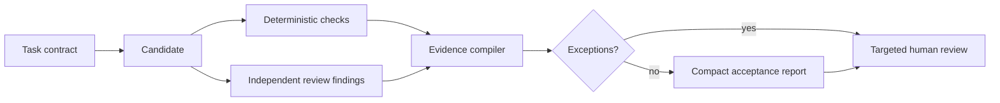

# ShipTask и работа с несколькими AI-агентами

Статус: exploratory report, 2026-08-11. Это источник идей, а не принятая
specification и не описание уже реализованного поведения `$ship-tasks`.

## Источник и метод

Источник — доклад Николая Сенина
[«Разработчик под нагрузкой: 7 правил по работе с несколькими AI-агентами»](https://www.youtube.com/watch?v=ndyCaE6ufJs).
Summary подготовлено по русской автоматической транскрипции YouTube с
таймкодами. Термины и численные примеры ниже пересказаны, а не считаются
эмпирическими результатами ShipTask.

Доклад рассматривает человека не как ещё одного исполнителя, а как диспетчера
очереди: человек формулирует задачи, принимает результаты и решает, что
отправить на доработку, пока несколько агентов выполняют работу параллельно.
Модель учитывает:

- тип задачи;
- время постановки;
- время автономного выполнения;
- время review;
- вероятность возврата на доработку;
- стоимость переключения контекста;
- стратегию выбора следующей задачи.

Автор сознательно не включает стоимость токенов и усталость оператора в
симуляцию. Поэтому модель полезна как способ увидеть ограничения потока, но не
как полная экономическая или эргономическая модель.

## Краткое summary ролика

### 1. Сначала снижать вероятность переделок

[Тезис начинается около 08:55](https://www.youtube.com/watch?v=ndyCaE6ufJs&t=535s).
Каждый возврат повторно потребляет постановку, review, внимание и место в
очереди. В симуляции автора эта зависимость нелинейна: высокая вероятность
повторных циклов быстро уничтожает выигрыш от параллельности.

Практический совет — анализировать причины переделок отдельно по типам задач,
а затем устранять конкретные причины через более точную specification,
инструкции, tests, linters, специализированные skills/tools или возможность
агента самостоятельно проверить результат.

### 2. Затем сокращать стоимость review

[Тезис начинается около 14:43](https://www.youtube.com/watch?v=ndyCaE6ufJs&t=883s).
Когда review занимает много времени, готовые результаты образуют очередь, а
агенты простаивают. Автор предлагает ускорять восприятие результата: давать
компактное представление, схемы, диаграммы или интерактивный HTML там, где они
действительно удобнее сырого текста.

В секции вопросов прозвучало важное ограничение: для некоторых инженеров код
проверяется быстрее диаграмм. Автор согласился, что формат нужно выбирать по
реальному bottleneck конкретного человека, а не вводить диаграммы как догму.

### 3. Ускорять постановку без потери качества

[Тезис начинается около 17:50](https://www.youtube.com/watch?v=ndyCaE6ufJs&t=1070s).
Предлагаются параллельное read-only изучение большой кодовой базы, карта
модулей, режим интервью для выявления требований и голосовой ввод. Цель не
сделать prompt короче любой ценой, а быстрее получить достаточный контекст и
качественную постановку.

### 4. Увеличивать долю полезной автономной работы

[Тезис начинается около 20:24](https://www.youtube.com/watch?v=ndyCaE6ufJs&t=1224s).
Чем дольше агент способен работать по достаточно точной specification и
самостоятельно сверяться с формальными критериями, тем меньше относительная
стоимость постановки и review. Мелкие однотипные изменения иногда выгодно
передавать одним связным batch.

### 5. Не максимизировать число агентов само по себе

[Тезис начинается около 22:23](https://www.youtube.com/watch?v=ndyCaE6ufJs&t=1343s).
Добавлять параллельность имеет смысл, когда оператор действительно простаивает,
а система уже умеет выдавать качественные автономные результаты. Названные в
ролике «три-четыре агента» — наблюдение автора, не универсальная норма.

### 6. Выявлять high-touch, или «токсичные», задачи

[Тезис начинается около 23:03](https://www.youtube.com/watch?v=ndyCaE6ufJs&t=1383s).
Так автор называет задачи, одновременно требующие дорогого review и часто
возвращающиеся на доработку. Даже небольшая их доля способна занять основную
часть внимания оператора и заблокировать постановку других задач.

Предлагаемые маршруты: передать задачу специалисту с подходящим workflow,
выполнить вручную, отложить либо сначала сделать её потоковой — улучшить
specification, проверки и представление результата.

### 7. Диспетчеризировать по типам, а не только по очереди поступления

[Тезис начинается около 25:24](https://www.youtube.com/watch?v=ndyCaE6ufJs&t=1524s).
FIFO прост, но заставляет чаще переключать контекст. Для обычного потока автор
предпочитает batches из нескольких однотипных задач; urgency, value и
«токсичность» остаются дополнительными факторами выбора.

Итог доклада: улучшать multi-agent workflow следует не хаотичным добавлением
инструментов и агентов, а через наблюдаемые параметры каждого типа задач —
rework, review, постановку, автономность и context switching.

## Что уже отражено в ShipTask

У [текущей ShipTask Architecture](../skills/ship-tasks/architecture.md) и доклада уже есть сильное
пересечение:

- planning handoff, acceptance и deterministic checks уменьшают причины
  переделок;
- отдельные deterministic checks, independent agent review и human acceptance
  не позволяют выдавать промежуточный сигнал за terminal evidence;
- review-ready queue и WIP limit уже моделируют человека как ограниченный
  review-resource;
- `available_review_buffer` уже ограничивает `active_target`;
- routine tasks группируются по общей product/code surface;
- risky и decision-required work не скрываются в большом batch;
- adaptive execution ограничивается безопасным target, а serial сохраняется
  для одной ready task и связного write-critical path;
- lifecycle явно содержит `changes-requested → rework`.

Поэтому переносить «семь правил» в `SKILL.md` буквально не нужно. Полезнее
уточнить несколько отсутствующих понятий в specification и позже проверить их
на реальных runs.

## Выбранное направление для дальнейшей проработки

Уточнено 2026-08-13 по обратной связи пользователя. Ниже зафиксированы идеи,
которые пользователь явно считает полезными для ShipTask. Это приоритеты
дальнейшего проектирования, но ещё не нормативное изменение workflow и не уже
реализованное поведение skill.

Выбраны четыре связанные идеи:

1. группировать подходящие задачи в небольшие review batches;
2. классифицировать задачи по типу, риску и ожидаемой стоимости review;
3. отдельно выявлять и маршрутизировать `high-touch`, или «токсичные», задачи;
4. после выполнения выдавать удобоваримый отчёт о результате и проверках,
   включая уместные диаграммы и другой task-specific формат представления.

### 1. Review batches по близкому контексту

Batch должен уменьшать переключение человеческого контекста, а не превращать
несколько изменений в один неразделимый diff. В один review batch можно
собирать candidates, когда у них совместимы:

- `task_type` и способ проверки;
- product/code context;
- уровень риска и review profile;
- reviewer и acceptance authority;
- момент готовности к review.

Каждая задача внутри batch сохраняет отдельные `task_id`, candidate identity,
evidence и возможность принять, вернуть или откатить её независимо.

В routine batch нельзя скрывать `risky`, `decision-required` или `high-touch`
candidate. Размер batch должен ограничиваться ожидаемой review-нагрузкой, а не
фиксированным количеством задач. Упомянутые в докладе три-пять задач остаются
эвристикой автора, а не универсальным контрактом ShipTask.

### 2. Независимые оси классификации

Для dispatch и review недостаточно одного общего ярлыка. Полезно различать:

| Ось | На какой вопрос отвечает |
|---|---|
| `task_type` | Какие контекст, verification profile и формат отчёта подходят задаче? |
| `risk_class` | Каков возможный ущерб ошибки и чьё решение требуется? |
| `review_load` | Сколько человеческого внимания, вероятно, потребует один проход review? |
| `rework_risk` | Насколько вероятен повторный цикл после первого review? |
| `execution_surface` | Можно ли безопасно исполнять эту задачу параллельно с другими? |

На первом этапе `review_load` и `rework_risk` могут быть ordinal-оценками
`low | medium | high`. Позже их следует калибровать по наблюдаемым human
minutes, first-pass acceptance и rework cycles, а не выдавать субъективную
оценку модели за точный прогноз.

### 3. Отдельный маршрут для high-touch tasks

`High-touch` — нейтральное имя для того, что в докладе названо «токсичной»
задачей. В рабочей гипотезе это candidate с высокой review-нагрузкой и высоким
риском переделки:

```text
high-touch ≈ high review_load + high rework_risk
```

Это не синоним высокого продуктового или операционного риска: механически
безопасная задача тоже может быть очень дорогой для понимания и приёмки.

Предпочтительный маршрут:

1. не включать задачу в routine batch;
2. выполнять serial либо резервировать под неё отдельную review capacity;
3. до реализации усилить specification, oracle и verification profile;
4. использовать специализированное представление результата;
5. после каждого возврата записывать `rework_reason`;
6. при повторяемости улучшать workflow данного `task_type`;
7. если автоматизация не окупается, явно предложить ручное выполнение,
   делегирование специалисту или откладывание, не делая это скрытым fallback.

### 4. Guardrails для batching и облегчённого review

Ускорение восприятия не должно ослаблять доказательность. Обязательные
guardrails для предлагаемого направления:

- exact `run_id`, `task_id`, base и candidate identity;
- один writer на mutable execution surface;
- deterministic project checks завершаются до review-ready;
- agent self-report и agent-generated tests не считаются независимым
  acceptance evidence;
- scope drift, изменённые permissions, schema, dependencies, public contracts
  и external effects показываются как исключения, а не прячутся в summary;
- batch не объединяет authority: решение принимается для каждого candidate;
- диаграмма или HTML — интерфейс к evidence, но не замена evidence;
- полный diff, raw check results и provenance остаются доступными;
- риск и неизвестные показываются раньше косметических деталей;
- после `changes-requested` формируется delta-only packet с исправленным,
  повторёнными checks и оставшимися gaps;
- high-touch или conflicting candidate автоматически выводится из routine
  review flow.

### 5. Удобоваримый отчёт по выполненной задаче

После задачи нужен не сырой worker log и не длинный текст «что я сделал», а
компактный verification/review report. Он должен отвечать на решение человека:
можно ли принять результат, что именно доказано и где остаётся риск.

Минимальная структура одного candidate:

1. **Verdict.** `ready`, `blocked` или `changes-requested`; recommendation не
   подменяет human decision.
2. **Задача и identity.** Цель, `task_id`, exact base/candidate и scope.
3. **Что изменилось.** Кратко, в порядке влияния на систему.
4. **Acceptance matrix.** Каждый критерий связан с конкретным evidence и
   статусом `proved | failed | not-proved`.
5. **Verification.** Какие tests, linters, type/security/project checks реально
   исполнены; exit status и ссылка на полный output.
6. **Impact map.** Затронутые компоненты, зависимости и внешние эффекты в
   наиболее удобном для данного task type виде.
7. **Risks and exceptions.** Scope drift, неизвестные, ослабленные проверки,
   manual-only verification и residual risk.
8. **Быстрая ручная проверка.** Один короткий сценарий либо точная команда,
   если человеческая проверка ещё нужна.
9. **Decision surface.** Что именно требуется от человека: принять, выбрать
   вариант или вернуть конкретное замечание.

Концептуально отчёт собирается так:



`Evidence compiler` здесь — проектная идея: он не выносит решение, а собирает
machine-readable факты в стабильный, проверяемый и удобный для человека
decision surface.

### 6. Report profile зависит от типа задачи

Один обязательный формат для всех задач снова создаст лишнюю работу. Project
context может выбирать `review_profile`, например:

| Профиль | Основное представление |
|---|---|
| Code change | Impact-ordered files, critical diff, tests и contract changes |
| UI behavior | Annotated before/after, screenshot или короткий scenario replay |
| Architecture | Component/sequence diagram, decisions и changed boundaries |
| Policy/configuration | Decision table, effective before/after и affected scopes |
| External effect | Proposed action, target, reversibility, receipt и observed state |

Названия профилей и конкретные tools принадлежат project context или adapter,
а не generic core. Universal contract должен лишь требовать compact summary,
evidence references, risks, exact identity и доступ к полным деталям.

### 7. Что пока не выбрано

Следующие ранее обсуждавшиеся идеи не следует считать одобренными только из-за
этой фиксации:

- автоматическая acceptance по standing policy;
- выборочный human audit вместо review каждого candidate;
- фиксированные risk tiers и пороги auto-accept;
- автоматический merge, deploy или иной external effect;
- конкретная реализация `evidence compiler` или форматы диаграмм.

Их можно исследовать отдельно после того, как будут понятны реальные
`review_load`, причины rework и полезность предлагаемых reports.

## Идеи для ShipTask

### A. Развести task type, execution surface и risk class

Сейчас workflow знает writable surface и risk routing, но это не то же самое, что
поведенческий тип задачи из доклада:

- `execution_surface` отвечает, можно ли безопасно писать параллельно;
- `risk_class` отвечает, какой уровень принятия и изоляции нужен;
- `task_type` описывает похожий режим постановки, выполнения и review.

Например, две задачи могут менять разные файлы и быть безопасными для
параллельной записи, но требовать от человека двух тяжёлых контекстов. И
наоборот, разные product surfaces могут иметь один и тот же хорошо освоенный
тип review.

В generic core не следует зашивать названия вроде `frontend`, `bugfix` или
`deployment`. Project context или adapter может передавать стабильный
`task_type` и необязательный профиль:

- ожидаемая стоимость постановки и human review;
- ожидаемый rework risk;
- доступный verification profile;
- ожидаемая автономность;
- context affinity с другими ready tasks.

На первом этапе достаточно ordinal-значений `low | medium | high`. Точные
минуты и вероятности создадут ложную точность без runtime telemetry.

### B. Сделать review backpressure весовым

Текущий WIP limit по количеству candidates не различает пять механических
правок и один high-touch candidate. Стоит рассмотреть `review_load`, где каждый
candidate занимает разную долю буфера.

Концептуально:

```text
available_review_buffer = review_capacity - queued_review_load
```

`queued_review_load` может сначала быть ordinal-оценкой, а в будущем —
наблюдаемой стоимостью review и повторных циклов. Это продолжает существующий
`active_target`, не превращая skill в планировщик высокой нагрузки.

### C. Ввести отдельный маршрут для high-touch tasks

«Токсичная» в докладе означает дорогую для потока, а не опасную для продукта.
Поэтому это свойство нельзя смешивать с `risky`.

Нейтральное имя для ShipTask — `high-touch`. Возможный маршрут:

1. не помещать candidate в routine batch;
2. выполнять serial либо с отдельным review reservation;
3. выбрать специализированный adapter/verification profile, если он существует;
4. заранее показать пользователю ожидаемую review-нагрузку;
5. если задача повторяется, вынести улучшение её workflow в отдельное решение,
   не расширяя текущий scope автоматически.

Ручное выполнение или делегирование человеку остаётся project decision, а не
скрытым fallback основного workflow.

### D. Записывать причины `changes-requested`

Lifecycle уже показывает rework, но не объясняет его причину. Review event
может иметь короткий структурированный `rework_reason`, например:

- неполная или неверная specification;
- пропущенная dependency/authority;
- deterministic check failure;
- scope drift;
- продуктовая или архитектурная ошибка;
- неудобный review packet;
- иной project-defined reason.

Эти события позволят отличать defect результата от дефекта самого workflow.
Агрегация должна жить в opt-in runtime/helper, а не в Markdown skill. Сырые
логи, private content и автоматическое самоизменение skill для этого не нужны.

### E. Добавить type-aware dispatch policy

Dependency, authority и безопасность записи остаются жёсткими ограничениями.
Среди нескольких допустимых ready tasks следующую можно выбирать по такому
порядку:

1. обязательный dependency/urgency/value;
2. доступный review buffer;
3. продолжение текущего task type или близкого context;
4. возможность собрать небольшой целостный routine batch;
5. изоляция high-touch work.

Это не означает «всегда группировать одинаковое»: срочная или блокирующая
задача может законно прервать batch. Policy должна быть объяснимой в review
packet или run evidence.

### F. Историческая идея exact и adaptive concurrency

Ниже сохранена исходная исследовательская идея, но её фиксированная schema не
является current ShipTask contract. Current Level 1 принимает natural-language
правила пользователя об exact/relative числе, ролях и условиях delegation, а
без такого правила выбирает topology автоматически. Пользователю не требуется
знать или использовать служебные поля proposal, чтобы выразить тот же смысл.

В исходном report предлагались два явных режима:

- `exact` — запрошенная topology является контрактом; недостаточная runtime
  capacity останавливает dispatch;
- `adaptive` — пользователь задаёт ceiling, а coordinator уменьшает или
  увеличивает `active_target` по dependency frontier и review pressure.

Эта конкретная schema с `active_target` и scheduler telemetry не была принята и
не должна использоваться для восстановления runtime policy. Её семантика
применима только в той мере, в какой пользователь сам выразил соответствующее
natural-language rule.

### G. Подбирать review packet под task type

Требование «один компактный экран» уже хорошее. Его можно усилить не
обязательными диаграммами, а `review_profile` из project context:

- code-first diff для изменений, где reviewer быстрее читает код;
- screenshot или короткий visual flow для UI;
- decision table для policy/configuration;
- before/after evidence для observable behavior;
- impact-ordered changed surfaces для cross-cutting change.

Формат должен сокращать время принятия без сокрытия evidence. Полная версия
diff/check output остаётся доступной по ссылке или команде.

### H. Использовать bounded read-only context harvest

Для большого или незнакомого scope несколько независимых read-only explorers
могут параллельно найти affected surfaces, tests и project constraints. Это
способ уменьшить время planning, но не основание параллелить writes.

Такой шаг оправдан только при действительно независимых вопросах и ожидаемом
выигрыше. Результат должен сводиться в один planning handoff с устранёнными
противоречиями; количество исследователей не является метрикой успеха.

## Что не стоит переносить как правило

- Не закреплять универсальный «приемлемый процент переделок». Числа в ролике
  получены из конкретной симуляции и не учитывают стоимость ошибок.
- Не считать `3–4` или `10–11` агентов оптимумом ShipTask. Оптимум зависит от
  dependencies, isolation, runtime capacity и review pressure.
- Не требовать диаграмму или HTML для каждого review. Формат зависит от задачи
  и reviewer.
- Не игнорировать token/compute cost. Автор исключил его из модели, но generic
  workflow не должен объявлять ресурс бесплатным.
- Не обещать полную автономию только из-за длинной specification. Human
  acceptance и внешние полномочия остаются отдельными границами.
- Не делать автоматическое обучение на всех session logs по умолчанию: это
  требует opt-in, privacy boundary, durable runtime и проверяемой процедуры
  изменения правил.
- Не превращать runtime skill в durable scheduler. Типизация, telemetry и
  durable queue принадлежат project context или отдельному runtime.

## Предлагаемый порядок проверки идей

1. Вручную размечать `task_type`, `review_load` и `rework_reason` в нескольких
   representative runs без изменения runtime contract.
2. Проверить, объясняют ли эти признаки реальные задержки лучше, чем простой
   candidate count и число active lanes.
3. Если сигнал устойчив, сначала уточнить specification: task dimensions,
   weighted review backpressure и high-touch routing.
4. Только после specification решить, какой минимум должен попасть в
   `ship-tasks/SKILL.md`, а что требует отдельного helper/runtime.
5. Проверить изменение fresh no-write и writable scenarios, не подсказывая
   агенту ожидаемый вывод.

## Вывод

Самая ценная мысль для ShipTask — оптимизировать не количество агентов, а поток
принятых результатов. У проекта уже есть правильная основа: review queue,
backpressure, bounded packets и human acceptance. Следующий содержательный шаг
— добавить недостающую ось `task_type`, учитывать вес review-нагрузки и
собирать причины rework. Это даст coordinator основание выбирать topology и
следующую задачу по наблюдаемым ограничениям, не ослабляя authority,
verification и человеческую приёмку.
