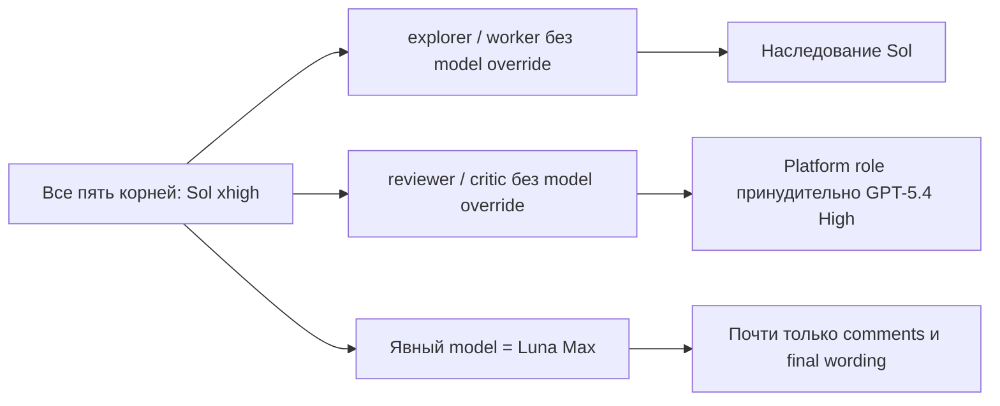

# Issue Grinder: аудит пяти режимов и маршрутизации моделей

Дата: 2026-09-01. Benchmark ID:
`20260901-00000000-0000-4000-8000-9fb1a6e0d9a5`.

Статус: прежний рейтинг режимов отозван. Эксперимент пригоден как диагностика
маршрутизации и протокола, но не как честное сравнение эффективности пяти
режимов.

## Технический итог

Низкое использование Luna — не общая проблема всех пяти режимов. `Соло`
сработал по модели правильно: ноль subagents и 100% корневого Sol.
`Классический` также ожидаемо остался почти полностью на Sol, хотя Luna в нём
получала в основном публикационный текст, а не strict-simple implementation.

Маршрутизация явно сломалась в трёх cost-aware режимах:

- `Экономичный`: Sol выполнил исследование, реализацию, интеграцию и UAT;
  все 18 Luna-сессий были объясняющими или финальными текстовыми пакетами;
- `Баланс`: Luna получила 1,48% токенов и использовалась вложенными providers
  публикационного текста, тогда как реализация и основная разведка шли на Sol;
- `Рой`: Luna получила 1,31% токенов и четыре comment-пакета; scouts и writers
  были Sol, а critic/reviewers — GPT-5.4.

GPT-5.4 появилась не как явное решение режима. В `Балансе` и `Рое` coordinator
создавал агентов с platform role `reviewer` или `critic` без явного профиля.
Эти типы автоматически исполнялись на GPT-5.4 High. Это скрытый побочный эффект
dispatch API, который mode contract не контролировал.

## Исправленный расход: только дерево каждого прогона

Account-window telemetry прежнего отчёта включала центральный контроллер и
завышала расход режимов на 19–26%. Ниже учитываются корень delivery run и все
его рекурсивные descendants, но не измерительный controller.

| Режим | Токены дерева | Sol | Luna | GPT-5.4 | Реально агентов |
| --- | ---: | ---: | ---: | ---: | ---: |
| Экономичный | 81,87 млн | 67,07 млн · 81,93% | 14,80 млн · 18,07% | — | 23 |
| Соло | 39,13 млн | 100% | — | — | 0 |
| Баланс | 304,96 млн | 279,52 млн · 91,66% | 4,52 млн · 1,48% | 20,92 млн · 6,86% | **33** |
| Рой | 182,36 млн | 165,80 млн · 90,92% | 2,39 млн · 1,31% | 14,18 млн · 7,77% | 17 |
| Классический | 55,72 млн | 54,07 млн · 97,03% | 1,66 млн · 2,97% | — | 14 |

Лишний controller расход прежних интервалов составлял соответственно 28,40 /
13,26 / 73,69 / 42,90 / 18,91 млн токенов. Поэтому изменения недельной квоты
`+3/+1/+10/+5/+2 п.п.` также характеризуют всё измерительное окно, а не чистый
расход режима.

## Наблюдаемая причина маршрутизации

Механизм профилей срабатывал там, где модель была задана прямо в
`spawn_agent`. Он не срабатывал как обязательное следствие выбранного режима.
Перед dispatch не было машинного gate, который связывал бы `canonical_mode`,
тип пакета, допустимую роль и фактическую модель. После dispatch также не было
раннего telemetry gate, способного остановить прогон при нарушении routing.

Из-за этого coordinator мог:

1. оставить содержательную работу корневому Sol;
2. создать `explorer`/`worker` без override и получить ещё один Sol;
3. создать `reviewer`/`critic` и неявно получить GPT-5.4;
4. явно выбрать Luna только в уже существовавшем пути Strategic Explainer.

Раздельные mode-файлы уменьшают смешение инструкций, но сами по себе эту
проблему не исправляют. Нужен отдельный enforcement dispatch-профилей.

## Пять режимов: как должно было быть и что получилось

### Соло

Контракт: один exact current top-level profile, одна execution lane, ноль
subagents. Luna не должна появляться, если корневой профиль — Sol.

Факт: 39,13 млн токенов Sol, ноль Luna/GPT-5.4, ноль agents. Model routing
соответствует режиму. Остановка перед Team grant относится к action-time
подтверждению изменения permissions: это protocol/infrastructure-invalid
outcome, а не провал режима или нехватка Luna.

### Классический

Контракт: controller/reviewer Sol делает почти всё; Luna получает только
strict-simple, bounded и объективно проверяемые packets.

Факт: 97,03% Sol и 2,97% Luna. Количественно это ожидаемо. Два Sol explorers
помогали корню, а 12 Luna-сессий назывались `comment`, `review` или `uat_final`
и в основном готовили текст. Поэтому доля моделей близка к обещанию, но роль
Luna не доказывает предусмотренную strict-simple implementation. Это не тот же
класс дефекта, что в трёх cost-aware режимах.

### Баланс

Контракт: Sol принимает material decisions и выполняет final gate; Luna Max
должна делать основную массу лёгкой и средней bounded implementation,
исследования, тестов и preliminary verification.

Факт: 91,66% Sol, 1,48% Luna и 6,86% GPT-5.4. Рекурсивный подсчёт дал 33
agents: четыре больших Sol explorers, два Sol workers, десять других Sol
defaults, три reviewer-сессии с переходом на GPT-5.4 и 14 Luna providers,
почти полностью занятых публикационным текстом. Ни одного Luna implementation
worker не наблюдалось. Это прямое нарушение role routing.

`Баланс` оказался дороже `Роя` не потому, что отказался работать: он завершил
Release, получил 94/100 и UAT v65. Расход объясняют 33 против 17 agents, 808
против 496 top-level calls, 23 против 12 commits, 304 против 201 tests,
повторные repair/review cycles и три запуска запрещённого
`attachments-integration.test.ts`. Hard gate всё равно исключает результат из
сравнения.

### Рой

Контракт: большой объём дешёвых scouts, независимых implementation candidates,
critics, test authors и judges; затем reduction до одного проверяемого
candidate.

Факт: 90,92% Sol, 1,31% Luna и 7,77% GPT-5.4. Пять scouts и пять writers были
Sol; четыре Luna-сессии готовили comments; один critic и два reviewers
автоматически стали GPT-5.4. На реализуемые задачи приходился в основном один
writer: `tm335_writer`, `tm331_writer`, `tm332_writer`, `tm333_writer`.
`tm333_docs` был отдельной документационной работой, а не конкурирующим
implementation candidate. Значит, прогон был Sol-heavy pipeline, но не
наблюдаемым best-of-M.

### Экономичный

Контракт обещает максимальный безопасный прогресс почти без расхода дефицитного
профиля. Economical controller/supervisor и workers могут анализировать,
реализовывать, тестировать и проверять candidate.

Факт: 81,93% Sol. Пять Sol explorers потратили около 26,1 млн токенов, корневой
Sol — ещё около 41,0 млн; именно они владели содержательной работой. Все 18
Luna-сессий имели имена `explain_*` или `*_completion` и занимались
публикационным слоем. Это самый сильный routing failure серии.

Здесь есть и более глубокий разрыв спецификации с benchmark protocol. Все
корни принудительно запускались на Sol xhigh, а общий profile normalization
сохраняет non-Luna main как controller/reviewer. Поэтому текущий контракт не
может гарантировать «вообще без Sol» при фиксированном Sol root. Если смысл
режима — работа при почти исчерпанной дорогой квоте, следующий дизайн должен
либо запускать end-user benchmark с Luna-корнем, либо оставлять Sol-корень
только transport/authority shell без чтения кода, реализации и проверки и
считать его overhead отдельно.

## Что сделано с изоляцией mode-файлов

После разделения пяти режимов добавлен
`scripts/issue_grinder_mode_loading_smoke.py`. Он запускает пять fresh
ephemeral read-only Codex-сессий на Luna Low и анализирует command-execution
trace. Case закрывается, если агент:

- не прочитал installed `SKILL.md` или общий `execution-modes.md`;
- прочитал не выбранный mode-файл;
- обратился ко всему каталогу `references/modes/`;
- сообщил другой canonical mode или расходящийся список файлов.

Фактический прогон 2026-09-01 прошёл 5/5. Каждая сессия открыла ровно один файл:
`solo.md`, `classic.md`, `balance.md`, `swarm.md` или `economical.md`; broad
directory access и чтение соседних файлов не наблюдались. Этот тест доказывает
progressive disclosure установленного plugin, но не model routing полноценной
delivery.

## Почему эксперимент нельзя ранжировать

Кроме сломанной маршрутизации, сравнение нарушают независимые protocol defects:

- A–D получили ошибочное требование сохранять неизменными все данные вне Team;
  только E стартовал с исправленным правилом для трёх Team-таблиц;
- D был остановлен и продолжен после изменения протокола;
- B остановился на обязательном action-time confirmation, тогда как другие
  прогоны прошли похожую ACL-мутацию без симметричного подтверждения;
- C трижды запустил запрещённый integration test и выбыл по hard gate;
- прежние token totals включали различный controller overhead;
- выполнен один стохастический run каждого режима, без повторов.

Blind scores остаются характеристикой пяти конкретных candidates. Они не
являются оценкой соответствующих режимов, потому что `Баланс`, `Рой` и
`Экономичный` не исполнили свою model topology. Выводы «Рой лучше» и
«Экономичный — лучший баланс» отозваны.

## Следующее исправление

До нового benchmark нужен общий routing gate, а затем отдельный review каждого
mode contract.

Общий gate должен до каждого dispatch фиксировать и проверять:

- `canonical_mode`, packet purpose и классификацию сложности;
- semantic role отдельно от platform `agent_type`;
- allowed model/effort и фактически выбранный model/effort;
- причину дорогого fallback и evidence предыдущей дешёвой попытки;
- запрет неявных `reviewer`/`critic`, если GPT-5.4 не разрешена контрактом;
- post-dispatch read-back модели и раннюю остановку run при mismatch.

Mode-specific направления:

- `Соло`: сохранить ноль subagents; Luna не является целевой метрикой;
- `Классический`: не вводить искусственную минимальную долю Luna, но направлять
  её только на доказанные strict-simple packets, а не считать текст
  implementation;
- `Баланс`: запретить Sol implementation для eligible bounded packet без
  reason-coded исключения; Luna должна пройти implementation/test wave до
  дорогого review;
- `Рой`: scouts, candidates, critics и judges по умолчанию должны быть
  economical; material fork обязан иметь наблюдаемую независимую candidate
  wave либо режим должен честно зафиксировать отсутствие применимого fork;
- `Экономичный`: отдельно решить пользовательский контракт для Sol — ноль Sol
  вообще либо transport-only Sol overhead. Текущая формулировка допускает
  слишком много дорогой работы.

Следующий benchmark должен использовать byte-identical prompt, recursive
thread-tree telemetry, allowlist тестов, симметричное action-time подтверждение
и ранний routing gate. Для проверки почти бесплатного `Экономичного` нужен
отдельный end-user run с Luna controller; фиксированный Sol root отвечает на
другой вопрос.

## Методика и границы вывода

Аудит сопоставил четыре слоя evidence:

1. исправленные tree-only token totals;
2. рекурсивную связь `parent_thread_id` всех session trees;
3. фактические `turn_context.model`, agent path и semantic/platform role;
4. текущие mode contracts, семантически эквивалентные monolithic contract
   времени benchmark до последующего file-only refactor.

Root threads: `00000000-0000-4000-8000-5598787cf8b9`,
`00000000-0000-4000-8000-a00c3d72c284`,
`00000000-0000-4000-8000-47369b673a87`,
`00000000-0000-4000-8000-143c42384cb2`,
`00000000-0000-4000-8000-8bbb71d8f2b7`.

Точные totals слегка зависят от event boundary и последнего token event;
таблица использует исправленный benchmark audit с округлением до 0,01 млн, а
raw recursive reconstruction применяется как независимая проверка состава
дерева и назначения ролей. Token share не заменяет role audit: маленькая Luna
задача может быть правильной в `Классическом`, а высокая доля Luna сама по себе
не доказывает независимые candidates в `Рое`.

Кандидатские defects из blind evaluation остаются полезными code-review
наблюдениями, но не используются для ранжирования режимов. Product Production
не читался и не изменялся. Финальная очистка reset API и Team fixtures остаётся
подтверждённой исторической частью benchmark.
